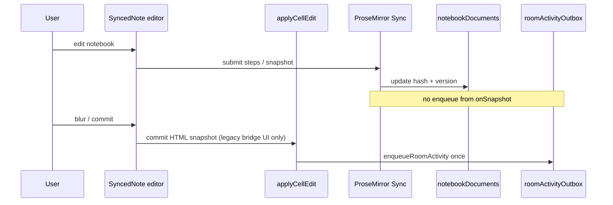
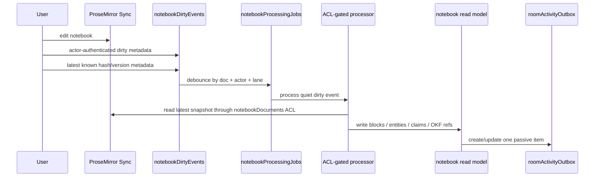

# Native Notebook Architecture

## Core rule

> ProseMirror Sync owns collaborative text.
> NodeRoom owns intelligence, evidence, proposals, and approval.
>
> Agents may **read** the notebook through a processed read model.
> Agents may **write** proposals, coach cues, evidence, and structured sidecars.
> Agents may only mutate the human-owned notebook through explicit user approval
> **or** a clearly labeled, append-only agent-owned block.

## Three layers

### 1. Source surfaces (human/imported)

These are human-owned or imported inputs. NodeRoom stores them but does not
allow agents to freely overwrite them.

- Collaborative notebook (ProseMirror Sync)
- Spreadsheet
- Uploaded PDFs / source captures
- Wall / sticky notes
- Research table

### 2. Processed read model (canonical agent-readable)

The agent-readable layer derived from source surfaces. This is where agents
reason before generating output.

Built from existing infrastructure:
- `roomActivityOutbox` - passive scan results and noteworthiness findings
- `entityWorkItems` - per-entity/facet work ledger
- `entityResearchCache` - freshness-aware research cache
- `okfConcepts` / `okfChunks` / `okfEdges` - portable room knowledge
- `sourceCaptures` / `evidenceFacts` - banker-grade evidence
- `retrievalEvents` - OKF retrieval audit trail
- `notebookBlocks`, `notebookClaims`, and `notebookMentions` - processed
  ProseMirror read-model rows written by the ACL-gated notebook processor

### 3. Agent output/proposal layer

Agents write here by default. Outputs are staged, not committed directly to
source surfaces.

- `roomActivityOutbox` findings - passive inbox items and coach cues
- Proposals (draft-first) - require user accept before touching human-owned artifacts
- `entityWorkItems` - queued research tasks
- Evidence cards - source-backed claims
- Proposed CellPayloads - sheet enrichment needing approval
- Review tasks
- Labeled agent-owned append block in notebook (post-acceptance only)

Only user-approved outputs promote into source surfaces.

## Editor: ProseMirror Sync + existing artifact model

### Feature flag

`VITE_NOTEBOOK_SYNC=prosemirror` - when set, renders the live collaborative
ProseMirror editor. When unset, keeps the existing Tiptap HTML-on-blur editor
(Option A fallback).

### Data model: backing `note` artifacts, not replacing them

The existing `note` artifact kind in `convex/schema.ts` is preserved.

The `notebookDocuments` registry maps:
```
(roomId, artifactId, elementId="doc") -> prosemirrorDocId
```

The ProseMirror Sync component owns live collaborative text state. Its snapshot
callback is registry-only; it does not create passive intelligence events.

## Passive trigger invariant

For a given notebook edit, exactly one code path may enqueue passive room
activity. Document sync facts are not passive-intelligence domain events.

The ProseMirror `onSnapshot` callback updates only `notebookDocuments` registry
metadata: `latestSnapshotHash`, `latestIndexedVersion`, and timestamps.

There are now two named paths:

- Legacy/bridge UI path: `commit()` -> `applyCellEdit` ->
  `enqueueRoomActivity`. This remains the current UI compatibility path until
  the synced notebook save/idle flow is wired to `markNotebookDirty`.
- Shipped native backend path: `markNotebookDirty` ->
  `processNotebookDirtyEvent` -> `commitNotebookReadModel`. This is the new
  ProseMirror-native processing contract.

Both paths preserve the same invariant: the sync callback never creates
passive-intelligence work. The shipped native backend path is:

```text
ProseMirror Sync owns live notebook text
  -> actor-authenticated dirty metadata marks processing intent
  -> server debounce coalesces doc/actor/lane work
  -> processor reads latest snapshot through notebookDocuments ACL
  -> processor writes notebookBlocks / claims / mentions
  -> passive intelligence runs from the processed read model
```

The dirty signal is metadata, not a second copy of the notebook body. It carries
the actor and policy context that a raw server snapshot callback cannot infer.





### Lazy migration

On first open of a legacy `note` artifact with `VITE_NOTEBOOK_SYNC=prosemirror`:
1. Check `notebookDocuments` for an existing `prosemirrorDocId`.
2. If none exists, `ensureNotebookDoc` registers a random capability doc id and
   creates an empty ProseMirror baseline.
3. The legacy `elements["doc"]` value remains the fallback/export/checkpoint
   mirror while the synced editor owns live collaborative text.
4. Subsequent opens use the registered synced doc directly.

### Agent write boundary

Default: **proposal-first**. Agents write to proposals / inbox items / evidence
cards. They do not call `useTiptapSync`'s API directly.

The one exception: a labeled, append-only **agent notes block** stored in
`elements["doc:agent"]`. This is a separate element from the live ProseMirror
"doc" - agents write to it via the standard `applyAgentCellEdit` path with
`approvalPolicy: "draft_first"`. The user accepts or rejects in the Noteworthy
Inbox / proposals panel. When accepted, the block is displayed below the main
editor with a "NodeRoom" provenance badge.

## Two debounce layers (never conflated)

### Layer A - collaborative save/sync (protect UX + DB write volume)

Goal: keep the user's text saved and shared.

Timing:
- 300-1000 ms after typing pause (local editor debounce)
- Immediate on blur
- Immediate on `pagehide` / phone lock
- Immediate on manual save

This layer only saves collaborative text. It never calls an LLM, Firecrawl, or
Linkup, and it never creates passive-intelligence domain events.

The ProseMirror Sync component handles step-level sync. The current UI bridge
may still write a coarse HTML mirror through `applyCellEdit` for legacy
compatibility. In the shipped backend contract, `elements["doc"]` is treated as
a fallback/export/checkpoint mirror only, not the hot notebook text path.

### Layer B - passive agent debounce (protect cost + avoid noise)

Goal: wait until the note/cell is stable enough to inspect.

Timing:
- 8-20 seconds after quiet period (`DEFAULT_QUIET_MS = 12_000` in roomActivity.ts)
- Hard deadline: `maxWaitAt = firstEditAt + 60_000` (MAX_QUIET_MS)
- Batch aggregation for high-volume rooms

Legacy bridge implementation: `enqueueRoomActivity` / `debounceActivityScan` in
`convex/roomActivity.ts` and `convex/noteworthy.ts`, keyed per actor/source so
a shared notebook with many active users never produces debounce starvation.

Shipped native backend implementation: `notebookDirtyEvents` and
`notebookProcessingJobs` coalesce actor-authenticated dirty metadata by doc +
actor + processing lane. The processor writes a versioned read model, and the
passive classifier creates or updates one room activity item from that read
model. Remaining UI work is wiring synced editor idle/save events to
`markNotebookDirty`.

## Coach Mode: evaluative layer on the cue pipeline

The existing **advisory** Banker Coach (`BankerCoachPanel`, evidence/coach/
review/handoff tabs) is unchanged.

### What's new: evaluative cues

The passive noteworthiness scanner emits `create_coach_cue` for mid-confidence
items (`classifyNoteworthy` in `convex/roomActivity.ts`).

Evaluative enhancement: a coach cue in the Noteworthy Inbox becomes **clickable
into an inline explain-and-defend prompt**:

1. Show the target artifact/cell/source + an expected-answer outline derived
   from the evidence graph + OKF concepts.
2. User types/speaks their answer.
3. An `agentJob` (entrypoint `"room_work"`, mode `"coach_eval"`) runs the
   evaluation via the NodeAgent harness / RoomTools.
4. The result is stored on the originating `roomActivityOutbox` row's `finding`:
   `score`, `masteryTags`, `missedEvidenceRefs`, `reviewReadinessDelta`.

**Grounding rule**: every feedback item must cite a source / cell / trace /
`evidenceFact` / OKF concept. Ungrounded claims are dropped before writing.

The `reviewReadinessDelta` feeds into `buildBankerCoachPacket` readiness, which
in turn controls `readyForClientUse` in the BankerCoachPanel.

### Coach eval agentJob shape

```ts
{
  entrypoint: "room_work",
  mode: "coach_eval",
  request: {
    coachEval: {
      activityId: string,       // roomActivityOutbox row
      artifactRef: string,      // artifactId:elementId being evaluated
      userAnswer: string,       // user's typed answer
      expectedOutline: string,  // generated from OKF + evidence
    }
  }
}
```

Outcome written to `roomActivityOutbox.finding`:
```ts
{
  coachEval: {
    score: number,             // 0-1
    masteryTags: string[],     // e.g. ["understands_runway", "weak_on_burn"]
    missedEvidenceRefs: string[], // sourceCaptureId / evidenceFactId
    reviewReadinessDelta: number, // +/- delta to apply to readiness
  }
}
```

## Guardrails

- ProseMirror is the collaborative text substrate, NOT the knowledge database.
  The graph (nodes/relations/OKF/evidence/claims/tasks/cell payloads/traces)
  stays NodeRoom-owned.
- Do not process ProseMirror steps or snapshots as agent events. Snapshots update
  registry hash/version metadata. The legacy bridge passive path comes from the
  NodeRoom commit path; the shipped native backend path comes from
  actor-authenticated dirty metadata plus the processed read model.
- `elements["doc"]` is a legacy fallback/export/checkpoint mirror for native
  notebooks, not the hot source of truth.
- A dirty signal is allowed to contain doc id, actor id, visibility, observed
  version/hash, edited block/range, and timestamps. It must not contain the full
  notebook body.
- Agents do not freely edit the live notebook. Proposal-first, plus the one
  labeled append-only block.
- Coach Mode is artifact-grounded: no feedback without an evidence/source/
  cell/trace/OKF concept ref.
- Batch agent outputs: one patch bundle with payload-hash skip, not one mutation
  per fact.
- Observers get sentence-level / summary updates; only focused artifact/range
  subscribers get detailed patches.

## Shipped backend slice: tables and functions

The first backend slice is implemented in `convex/schema.ts` and
`convex/notebookProcessing.ts`. ProseMirror still owns live collaborative text;
NodeRoom owns dirty metadata, ACL-gated processing, read-model rows, and the
single passive-intelligence item derived from those rows.

Shipped tables:

```text
notebookDirtyEvents
  roomId
  artifactId
  notebookDocumentId
  prosemirrorDocId
  actor
  actorId
  visibility
  ownerId
  observedSnapshotVersion
  observedSnapshotHash
  changedRangeHint
  dirtyAt
  maxWaitAt
  processingLane
  state: pending | processing | processed | superseded | failed

notebookProcessingJobs
  dirtyEventId
  roomId
  artifactId
  prosemirrorDocId
  actorId
  visibility
  ownerId
  docVersion
  docHash
  processorVersion
  schemaVersion
  startedAt
  completedAt
  resultSummary

notebookBlocks / notebookClaims / notebookMentions
  source dirtyEventId
  source snapshot version/hash
  text/hash, claims, entity mentions, visibility, owner

agentArtifacts
  kind: agent_work_plan
  status: draft | proposed | approved | executed | rejected | superseded
  payload
  payloadHash
  planHash
  approvedBy / approvedAt
  executedJobId
```

Shipped function split:

| Function kind | Responsibility |
|---|---|
| `mutation` | `markNotebookDirty` validates requester proof, visibility, actor, and idempotency, then writes metadata only. |
| `action` | `processNotebookDirtyEvent` claims the dirty event through ACL/revocation checks, then reads the latest ProseMirror snapshot and extracts blocks/claims/entities. |
| `mutation` | `commitNotebookReadModel` writes versioned read-model rows and creates/updates the one passive item. |
| `query` | `listNotebookBlocks` and `listAgentArtifacts` filter by room, visibility, and owner. |

Regression coverage lives in `tests/notebookProcessingTarget.test.ts`:

- one ProseMirror edit creates one dirty event per actor/lane;
- one dirty event produces one read-model update;
- one read-model update creates or updates one passive item;
- processing rechecks active membership before snapshot reads;
- `onSnapshot` never creates `roomActivityOutbox`;
- `elements["doc"]` is not hot-written on every native notebook edit;
- private notebook read model never feeds a public job;
- `agent_work_plan` approval requires the submitted `planHash` to match the
  stored structured payload before a queued `agentJobs` row is created/reused.

Remaining product work is UI/deployed proof, not backend schema invention:

- wire synced notebook idle/save events to `markNotebookDirty`;
- render the Agent Work Plan review surface;
- render planned-vs-actual after execution;
- prove the flow in a browser/deployed room.

## References

- Convex ProseMirror Sync: https://www.convex.dev/components/prosemirror-sync
- GitHub: https://github.com/get-convex/prosemirror-sync
- Convex Components: https://docs.convex.dev/components/using
- `convex/roomActivity.ts` - `enqueueRoomActivity`, `classifyNoteworthy`
- `convex/noteworthy.ts` - `debounceActivityScan`, `scanActivity`
- `src/ui/panels/Artifact.tsx` - `Note()` (legacy), `SyncedNote()` (new)
- `src/ui/insights/NoteworthyInbox.tsx` - passive inbox, coach cue pill
- `src/ui/artifacts/BankerCoachPanel.tsx` - advisory coach (unchanged)
- `convex/schema.ts` - `notebookDocuments`, `roomActivityOutbox`
- `convex/notebookProcessing.ts` - dirty events, processor jobs, read model,
  and passive item bridge
- `convex/agentArtifacts.ts` - first `agent_work_plan` approval by `planHash`
- `tests/notebookProcessingTarget.test.ts` - backend slice regression coverage
- `docs/AGENT_ARTIFACTS.md` - structured work plans, diffs, evidence,
  coach feedback, and planned-vs-actual reports
