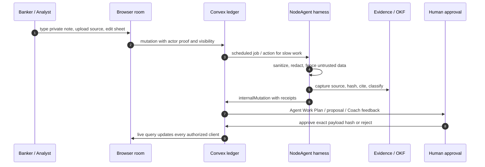

# Security, Accessibility, and Production Readiness

## Honest Claim

NodeRoom has the architecture answer for a high-trust human-agent workroom. It
does not claim full enterprise compliance until the repo and deployment have the
evidence that a buyer, auditor, or incident reviewer would ask for: policies,
tests, access reviews, retention proofs, deletion/export verification,
monitoring dashboards, restore drills, incident runbooks, and vendor agreements.

The product story is:

```text
Convex = live OLTP room ledger
NodeAgent = governed model/tool harness
OKF / Evidence Accountant = proof layer
OLAP warehouse = later analytics and compliance reporting
```

Convex is the source of truth for current room state. It is not the BI
warehouse. Long scans, cost reporting, trend dashboards, and compliance reports
belong in an analytics warehouse after the live product invariants are proven.

## Standards Map

| Standard | How NodeRoom uses it |
|---|---|
| [NIST CSF 2.0](https://www.nist.gov/publications/nist-cybersecurity-framework-csf-20) | Risk-management language for Govern, Identify, Protect, Detect, Respond, and Recover. |
| [OWASP ASVS](https://owasp.org/www-project-application-security-verification-standard/) | Web-app security verification baseline for auth, access control, validation, secrets, logging, and API controls. |
| [WCAG 2.2](https://www.w3.org/TR/WCAG22/) | Accessibility target for notebook, spreadsheet, Copilot, Coach Mode, evidence, and Visual Plan surfaces. |
| [European Commission GDPR guidance](https://commission.europa.eu/law/law-topic/data-protection/data-protection-explained_en) | Applies when NodeRoom processes EU personal data; drives export, deletion, minimization, purpose, and accountability controls. |
| [HHS HIPAA Security Rule](https://www.hhs.gov/hipaa/for-professionals/security/index.html) | Applies only if NodeRoom handles ePHI or operates as a business associate; not a default claim. |

## Query, Mutation, Action Language

NodeRoom's production model is easiest to explain through Convex function
boundaries:

| Convex language | Production role |
|---|---|
| `query` | Live reads only after membership and visibility checks. Queries can reveal current room state, read models, evidence cards, usage snapshots, and audit/security event lists, but must not create durable side effects. |
| `mutation` | Short, transactional writes. Mutations own actor proof, CAS, room membership, private/public visibility, approval receipts, deletion requests, and audit append rows. |
| `internalMutation` | Backend-only commits from actions/workflows. Agent receipts, evidence writes, security events, telemetry pruning, and job state transitions belong here when the browser should not call them directly. |
| `action` | Slow or external work. Model calls, crawlers, provider parsers, and downstream integrations run outside the database transaction, then return to checked mutations for durable writes. |

The agent does not get a special back door. It can plan, inspect authorized
context, call allowed tools, and propose or commit through the same checked
Convex write paths.

## Battlefield Flow



The happy path is not "the model edited everything." The happy path is that the
room stays live, private data stays private, evidence is inspectable, the human
approves structured changes, and the final state is explainable later.

## Implementation Surfaces Added

| Surface | Files | What it prevents from regressing |
|---|---|---|
| Input and rendering safety | `src/security/sanitize.ts` | Control characters, unbounded text, and accidental HTML trust. |
| PII detection and redaction | `src/security/pii.ts`, `src/security/redaction.ts` | Public previews and logs accidentally carrying obvious PII. |
| Prompt-injection fencing | `src/security/promptInjectionFence.ts` | Untrusted notebook, spreadsheet, chat, or source text becoming instructions. |
| Audit hashing | `src/security/auditHash.ts`, `convex/auditLog.ts` | Receipt rows drifting away from deterministic, hashable payloads. |
| Rate/usage limits | `src/security/rateLimit.ts`, `convex/usageLimits.ts` | Quota logic becoming ad hoc across UI, agent, and backend paths. |
| Accessibility helpers | `src/accessibility/*` | Live regions, keyboard grid movement, focus containment, and reduced motion drifting out of product surfaces. |
| Security events | `convex/securityEvents.ts` | Security-relevant events disappearing into generic logs. |
| Export/delete boundary | `convex/exportDelete.ts` | Product claiming physical deletion before the operator-runbook path is implemented and verified. |
| Telemetry retention policy | `convex/retention.ts` | Telemetry pruning accidentally being described as product-data deletion. |

## Backend Comparison

The invariant is backend-neutral:

| Backend | Same production rule |
|---|---|
| Convex | Put actor-proofed live reads in `query`, transactional commits in `mutation`, and slow provider/model work in `action`. Use room-scoped indexes and internal mutations for agent commits. |
| Postgres / Rails / Django | Put membership checks in row-level policy or service methods, wrap writes in transactions, enqueue background jobs for slow work, and record append-only audit rows. |
| Supabase | Use RLS for room/workspace isolation, Edge Functions for external work, and Postgres tables for audit/security events and deletion requests. |
| Firestore | Use security rules plus server functions for privileged writes; do not trust client-side filters for private data. |
| DynamoDB | Use tenant partition keys, condition expressions for CAS, Streams/Lambda for asynchronous processing, and separate audit/security-event tables. |

The implementation detail changes. The rule does not: never attach business
authority to low-level sync callbacks, and never let the model bypass the
checked authorization and approval path.

## Visual Plans

- [`plans/security-production-readiness/plan.mdx`](../plans/security-production-readiness/plan.mdx)
- [`plans/accessibility-wcag22/plan.mdx`](../plans/accessibility-wcag22/plan.mdx)
- [`plans/incident-response-disaster-recovery/plan.mdx`](../plans/incident-response-disaster-recovery/plan.mdx)
- [`plans/multi-tenancy-data-isolation/plan.mdx`](../plans/multi-tenancy-data-isolation/plan.mdx)
- [`plans/privacy-retention-deletion/plan.mdx`](../plans/privacy-retention-deletion/plan.mdx)
- [`plans/load-stress-chaos-testing/plan.mdx`](../plans/load-stress-chaos-testing/plan.mdx)

Code snippets for the teachable guardrail slice are generated with Shiki:
[`docs/visuals/security-production-readiness-code.html`](visuals/security-production-readiness-code.html).

Regenerate with:

```bash
npm run docs:code-visuals
```

## Manual Dogfood Script

```text
1. Create a fresh room.
2. Join as User A and User B.
3. User A types a messy private note with person/company/source details.
4. Confirm passive intelligence does not leak private text to User B.
5. User A promotes selected findings to room-visible research.
6. Agent creates an Agent Work Plan.
7. User approves the exact plan hash.
8. Agent captures source evidence.
9. Spreadsheet receives evidence-backed CellPayloads.
10. User B edits C2 while the agent works on A1:C5.
11. Confirm C2 is preserved and the agent result becomes a proposal.
12. Open Coach Mode.
13. User explains the result.
14. Coach feedback cites exact source/cell/evidence.
15. Request room export manifest.
16. Test keyboard-only navigation across notebook, sheet, coach, evidence.
17. Run with reduced motion.
18. Trigger a failed provider call and verify graceful fallback.
19. Check audit receipt and planned-vs-actual artifact.
20. Request room deletion and verify that the product records an operator-runbook request instead of claiming physical purge.
```

## Interview Wording

> NodeRoom's risk is not just normal web-app risk; it is human-agent
> collaboration risk. Convex handles the live transactional room. NodeAgent runs
> governed external work and commits through checked mutations. Agent outputs are
> evidence-backed plans, proposals, or CellPayloads, not raw hidden writes.
> Accessibility targets WCAG 2.2 AA. App security maps to OWASP ASVS. Risk
> management maps to NIST CSF. GDPR and HIPAA require additional policy,
> contract, retention, deletion, and audit evidence before any compliance claim.

The mature claim is not "we are compliant." The mature claim is "we know which
controls matter, where they live in the architecture, which parts are tested,
and which parts still require deployment evidence."
