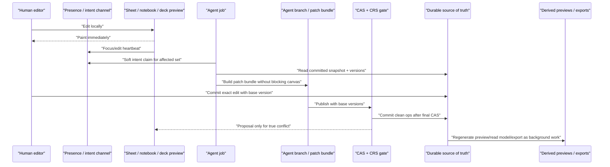

# Realtime Human + Agent Coediting

Status: target architecture with the first spreadsheet runtime slices shipped.
This extends the existing Convex-ledger rule with the UX contract for fast
human + agent collaboration across spreadsheet, notebook, and deck surfaces.
As of 2026-06-20, spreadsheet presence, server-side agent intent claims, and
deferred semantic-index refresh are implemented; plan-time affected sets,
patch-bundle publish, ProseMirror idle-save, and deck-plan collaboration remain
the next runtime layers.

## Product rule

The canvas must stay editable. A human should never see a cell, block, slide, or
component region replaced by a loading blur, disabled overlay, or inaccessible
agent-owned state during ordinary collaboration.

Collaboration feedback is visible but non-blocking:

- Presence ring: someone is focused or actively editing here.
- Intent claim: an agent plans to touch this area, but humans can keep editing.
- Draft/proposal badge: the agent has a suggested change ready.
- Commit lease flash: a short publish window on exact targets only.
- Conflict card: shown only when CAS or CRS proves the meaning changed.

Hard locks remain a correctness tool for narrow publish windows and legacy
managed writes. They are not the primary human-visible collaboration model.

## Source-of-truth per surface

| Surface | Live interaction owner | Durable source of truth | Agent write shape |
|---|---|---|---|
| Spreadsheet | Local grid runtime for typing, selection, fill, formula bar | `elements` rows with per-cell `version` | Patch bundle of cell ops with base versions, final CAS, CRS only on meaningful conflict |
| Notebook | ProseMirror Sync | ProseMirror document mapped by `notebookDocuments`; read model is derived | Comment-scoped proposal, sidecar cue, or labeled append block after approval |
| PowerPoint / deck | HTML preview and comment layer | `deck-plan` JSON with stable slide/component ids | `DeckDelta` against `basePlanVersion`; HTML/PPTX/PDF are derived exports |

HTML is preview and comment-edit UI for decks. It is not the deck source of
truth. PPTX/PDF are export formats, not collaborative state.

## Unified flow

The agent may observe presence, locks, proposals, and recent commits. It must
not reason over a human's uncommitted browser-local buffer unless the human
explicitly snapshots or commits it through the same proof-checked mutation path.

## Spreadsheet behavior

The spreadsheet keeps its current anti-clobber spine:

- Human edits are local first, then commit through `applyCellEdit`.
- Every committed cell carries a base version.
- CAS rejects stale writes as data.
- Agent writes use RoomTools and receipts.
- CRS classifies meaning conflicts above CAS.

The collaboration-feel upgrade is to avoid long visible hard locks:

1. Compute the affected set at plan time:
   `readSet + writeSet + formula dependency closure + drafts + proposals + presence`.
2. Write a soft intent claim for the affected set. This renders as an agent
   outline/lane, not as a disabled cell.
3. Let humans keep editing. Their commits win normally through CAS.
4. Agent works in a branch and streams narration separately from cell writes.
5. At publish, acquire a short commit lease on exact target cells only.
6. Apply clean ops in a patch bundle with final CAS.
7. For stale cells, run CRS. Auto-merge only deterministic safe cases; otherwise
   create a proposal card.

Batching rule: passive activity should be grouped by actor, artifact, surface,
and quiet window. Pasting or filling a range should create one activity batch,
not one passive-intelligence trigger per cell. The spreadsheet semantic index
should move toward incremental or background refresh: the live commit path must
not rebuild more derived state than the current edit requires.

## Notebook behavior

The serious notebook sync path is ProseMirror Sync, not full HTML blur commits.

- ProseMirror owns collaborative text.
- `notebookDirtyEvents` carry actor, lane, hash/version, and range hints.
- The processor reads the latest ProseMirror snapshot through ACL and updates
  derived read-model rows.
- Comments anchor to stable block/range ids.
- Agent edits are proposal-first by default.
- Approved agent changes apply through a ProseMirror-aware patch or a labeled
  append block, then produce dirty metadata for downstream indexing.

The legacy `elements["doc"]` HTML mirror is fallback/export/checkpoint state.
It must not be the hot collaboration path once the synced editor idle/save flow
is wired.

## Deck / PowerPoint behavior

Deck collaboration follows the Parity-style loop:

`deck-plan JSON -> HTML preview + comment-edit -> optional PPTX/PDF export`

The deck plan is the single source of truth:

- `deckPlanVersion` is the CAS baseline.
- Slides and components have stable ids/slugs.
- Comments anchor to `slideId`, `componentId`, and optional bbox.
- The agent returns a `DeckDelta`, not a rewritten deck blob.
- The evidence/honesty gate runs on deck-plan JSON before preview/export.
- HTML preview is regenerated from accepted plan state.
- PPTX/PDF export is background work from accepted plan state.

This gives PowerPoint the same collaboration ergonomics as the sheet: humans can
select, comment, and edit the visible preview while the agent drafts scoped
changes in a branch.

## Server-derived policy

The client submits intent, not execution policy.

Allowed client inputs:

- user goal or comment
- selected surface and scoped target ids
- optional explicit review preference
- idempotency key

Server-derived fields:

- `modelPolicy`
- `approvalPolicy`
- `autoAllow`
- `evidencePolicy`
- host/source allowlist
- rate limit bucket
- max affected-set size
- trace level

This keeps "chat beside the canvas" fast without letting a client weaken
approval, privacy, source, or spend policy.

## No-friction UI contract

Do:

- Paint remote presence as colored outlines, name tags, and small agent lanes.
- Keep the underlying cell/block/slide selectable and editable.
- Show agent work as draft overlays, side panels, or inline suggestion badges.
- Keep conflicts local to the affected target.
- Let users accept/reject proposals without leaving the canvas.

Do not:

- Blur or mask an editable region while the agent is working.
- Disable a whole range because an agent plans to edit part of it.
- Replace visible content with a spinner.
- Treat pending AI output as committed truth.
- Make users open a high-friction review UI for deterministic safe rebases.

## Implementation order

1. Add bounded presence/intent claims for cells, notebook blocks, and deck
   components. **Spreadsheet cell presence and server-side agent intent claims
   are shipped** via TTL-bound `presenceClaims`; notebook block and deck
   component claims are still next.
2. Add plan-time affected-set computation and persist it on agent jobs.
3. Batch activity events by quiet window and range.
4. Move spreadsheet semantic index refresh toward incremental/background work.
   **Initial coalesced background refresh is shipped**; deeper formula-aware
   incremental indexing is still next.
5. Add branch/patch-bundle publish with short commit lease and final CAS.
6. Wire notebook synced-editor idle/save to `markNotebookDirty`.
7. Add deck-plan JSON, `DeckDelta`, HTML preview regeneration, and export jobs.
8. Gate collaboration claims with two-context browser tests.

## Acceptance gates

- Two browsers editing the same sheet show non-blocking presence and no disabled
  cells.
- A human edit during an agent intent claim commits normally.
- Agent publish cleanly commits unchanged-baseline ops and proposes only true
  conflicts.
- Spreadsheet paste/fill produces one passive activity batch for the range.
- Notebook edits sync through ProseMirror and produce dirty metadata without
  HTML blur commits as the primary path.
- Deck comment edit changes a scoped `deck-plan` component, regenerates HTML,
  and exports PPTX/PDF only from accepted plan state.

Current runtime proof:

- `tests/presenceClaims.test.ts` proves presence is advisory and never blocks a
  CAS write, including a server-side `agent_intent` claim.
- `tests/spreadsheetIndexRefreshQueue.test.ts` proves spreadsheet index refresh
  requests coalesce behind the cell edit path.
- `tests/convexWallCrud.test.ts` proves wall post-it create/edit/delete flows
  through the same Convex versioned element mutation path.
- `e2e/realtime-presence.spec.ts` proves two browser contexts can see presence
  while the second user keeps editing the same sheet.
- `docs/eval/MEDIA_JUDGE.md` records the current Gemini 3.5 Flash video judge:
  publish, score 8/16, with a remaining P2 that the clip should show more
  simultaneous two-sided coediting.
