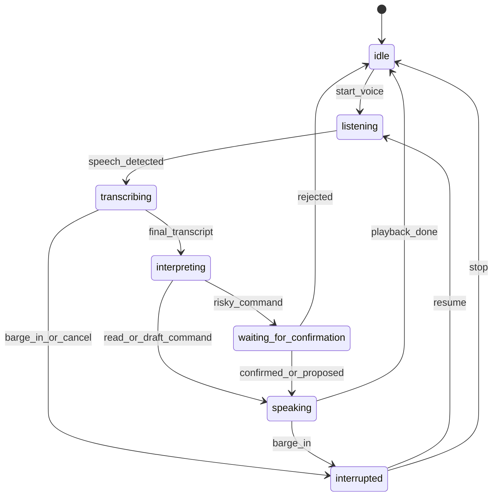
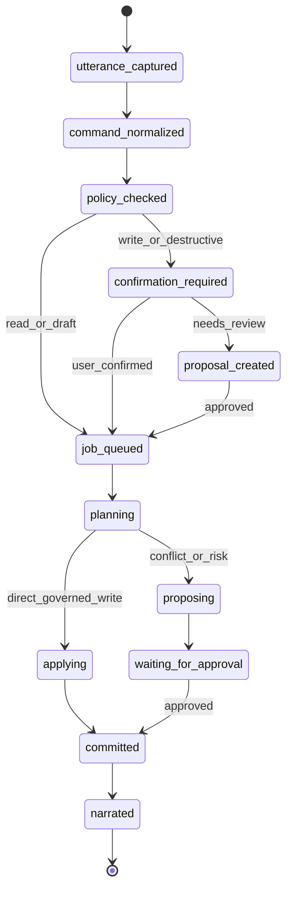

# Voice Agent Merge ADR

Status: merge packet plus first governed implementation slice. The implemented
voice layer lives under `src/voice` and stays behind NodeRoom governance.

## Goal

Integrate the Room OS voice-agent repository into NodeRoom without replacing
NodeRoom's collaboration, room ledger, or NodeAgent execution architecture.

The decision is:

- NodeRoom remains the source of truth for room state, public jobs, proposals,
  durable artifact edits, no-clobber behavior, and collaboration policy.
- Room OS contributes voice-session behavior: microphone lifecycle, STT/TTS
  orchestration, interruption handling, turn detection, acknowledgement-loop
  suppression, and voice UX primitives.
- NodeAgent remains the work/execution layer. Voice can start the same governed
  work that text can start, but it does not get a separate mutation path.

Voice must not directly mutate durable room state.

## Audit Inputs

NodeRoom sources inspected:

- `docs/ARCHITECTURE.md`
- `docs/architecture/CONVEX_AS_LEDGER.md`
- `docs/architecture/REALTIME_HUMAN_AGENT_COEDITING.md`
- `docs/NODEAGENT_ARCHITECTURE.md`
- `docs/OMNIGENT_INTEGRATION.md`
- `src/nodeagent/core/runtime.ts`
- `src/nodeagent/core/frameRunner.ts`

Room OS sources inspected from the local donor repo:

- `README.md`
- `src/voice/voiceAgent.ts`
- `src/voice/runVoiceMvp.ts`
- `src/voice/localAudioAdapters.md`
- `src/core/types.ts`
- `src/core/roomReducer.ts`
- `src/core/speechActClassifier.ts`
- `src/core/guards.ts`
- `src/live/pipeline.ts`
- `src/live/roomServer.ts`
- `src/client/live/roomClient.ts`
- `convex/rooms.ts`
- `convex/openai.ts`
- `convex/coordinator.ts`
- `tests/roomReducer.test.ts`
- `tests/liveSteering.test.ts`
- `tests/nodeAgentMvp.test.ts`

## Repository Audit Findings

### NodeRoom Current Architecture

NodeRoom is already a governed collaboration runtime. Convex is the operational
ledger for live room state, messages, artifact elements, locks, drafts,
proposals, traces, and agent jobs. NodeAgent work enters the durable job path,
uses RoomTools for reads/writes, and returns CAS conflicts, locks, pending
approval, and tool errors as data instead of bypassing the harness.

Relevant NodeRoom surfaces:

| Concern | Current NodeRoom owner | Notes for voice integration |
| --- | --- | --- |
| Operational room ledger | Convex room/artifact/job/proposal modules | Voice must submit commands into these paths, not write a parallel room store. |
| Agent execution | `src/nodeagent/core/runtime.ts`, `frameRunner.ts`, `types.ts` | NodeAgent remains the work layer. Voice is only a source of user intent and narration. |
| Tool calling | `AgentTool` plus `RoomTools` in `src/nodeagent/core/types.ts` | Tool execution already runs through the backend port; voice must not call tools directly. |
| No-clobber writes | CAS, locks, drafts, proposals, mutation receipts | Risky voice commands must use the same confirmation/proposal discipline. |
| Public/private boundary | room-visible jobs/messages plus private personal-agent lanes | Voice transcripts inherit the selected room/private scope and must not auto-promote. |
| Existing voice UI | `src/ui/mobile/MobileApp.tsx`, `src/ui/mobile/mobile.css`, `MobileIcons.tsx` | This is a UX shell; it is not a production STT/TTS gateway or durable voice command path. |
| Analytics/evals | proofloop/eval docs and receipts | Analytics remain downstream evidence; they do not enter the live mutation path. |

### Room OS Donor Architecture

Room OS proves useful voice-room primitives but also includes its own room state
and worker model. The donor repo has STT/TTS and live voice code in
`src/live/pipeline.ts`, local HTTP/SSE room transport in `src/live/roomServer.ts`,
Convex voice-room mutations/actions in `convex/rooms.ts`, provider helpers in
`convex/openai.ts`, and scheduler/orchestration actions in `convex/coordinator.ts`.
Its core reducer, speech-act classifier, and guards live under `src/core/`.

Relevant Room OS capabilities:

| Capability | Donor files | Integration stance |
| --- | --- | --- |
| STT | `src/live/pipeline.ts`, `convex/openai.ts`, `convex/coordinator.ts` | Adapt behind VoiceGateway. |
| TTS | `src/live/pipeline.ts`, `convex/openai.ts`, `src/voice/localAudioAdapters.md` | Adapt as best-effort narration from NodeRoom events. |
| Audio streaming / transport | `src/live/roomServer.ts`, `src/client/live/roomClient.ts` | Borrow local-dev transport ideas only; production state remains Convex/NodeRoom. |
| Voice session and turn handling | `src/core/roomReducer.ts`, `src/core/types.ts`, `tests/roomReducer.test.ts` | Adapt to short-lived VoiceSessionState, not durable room state. |
| Speech-act and steer classification | `src/core/speechActClassifier.ts`, `tests/liveSteering.test.ts` | Adapt into RoomCommand normalization and risk classification. |
| Guardrails | `src/core/guards.ts`, stale token checks in `convex/rooms.ts` | Reuse concepts for barge-in, stale-turn rejection, and confirmation policy. |
| Agent state / workers | `convex/rooms.ts`, `convex/coordinator.ts`, `tests/nodeAgentMvp.test.ts` | Discard as architecture owner; NodeAgent remains canonical. |

### Overlaps

- Both systems treat shared state as the authority instead of transcript prose.
- Both systems separate nondeterministic provider work from deterministic commits.
- Both systems need bounded traces and honest failure states.
- Both systems need stale-turn or stale-version guards before committing output.
- Both systems model human steering as structured state before agent work begins.

### Conflicts

- Room OS owns its own `RoomState`, goals, tasks, workers, artifacts, and
  utterance/traces tables. NodeRoom already owns those product surfaces.
- Room OS voice turns can mutate the donor room goal/reducer directly. NodeRoom
  voice turns must become governed RoomCommand events first.
- Room OS worker coordination overlaps NodeAgent. NodeRoom must not make Room OS
  the new agent runtime.
- Room OS HTTP/SSE local room server is useful for demos but conflicts with
  NodeRoom's Convex live room ledger if imported as production state.
- Room OS model routing and provider policy must not override NodeRoom's
  server-derived model, approval, evidence, privacy, and spend policy.

## Binding NodeRoom Decisions

These decisions remain binding for every voice phase:

- Convex/live database remains the operational room ledger.
- NodeAgent remains the execution layer for agent work.
- Room-visible jobs, public messages, proposals, and durable commits remain
  governed by NodeRoom.
- No-clobber behavior must be preserved through CAS, locks, drafts, proposals,
  and mutation receipts.
- Risky writes must use proposal or confirmation paths.
- ClickHouse or analytics storage must not enter the live mutation path.
- Public room agent and private personal agent permissions must remain separated.
- Existing text chat functionality must continue working.
- Voice must not directly mutate durable room state.

## Recommendation

Add a voice adapter layer, not a new orchestrator:

```text
Browser voice controls
  -> VoiceGateway
  -> RoomVoiceAdapter
  -> NodeRoom command bus
  -> agentJobs.start / existing text command path
  -> NodeAgent / RoomTools
  -> Convex room ledger
  -> TTS narration from committed room events
```

The VoiceGateway owns volatile voice-session state. The RoomVoiceAdapter turns a
completed voice turn into a normalized RoomCommand. NodeRoom then decides
whether that command is a read, draft, direct governed write, proposal, or
confirmation flow.

The bridge is a modality boundary:

```ts
type VoiceTurn = {
  roomId: string;
  actorId: string;
  transcript: string;
  partials: string[];
  startedAt: number;
  endedAt: number;
  confidence?: number;
  source: "voice";
};

type RoomCommand = {
  roomId: string;
  actorId: string;
  source: "voice" | "text" | "agent";
  commandText: string;
  intent?: string;
  riskLevel: "read" | "draft" | "write" | "destructive";
  requiresConfirmation: boolean;
  transcriptConfidence?: number;
  traceId?: string;
};
```

RoomCommand must route through the same server-derived policy used by text
commands. Clients can submit intent and transcript evidence; they cannot choose
approval policy, spend policy, evidence policy, or mutation mode.

## VoiceSessionState

VoiceSessionState is local or short-lived session state. It should be recoverable
from the room ledger plus current browser/audio state, not treated as product
truth.



This state machine owns:

- microphone permission and capture state
- partial transcript buffering
- VAD and silence timeout
- STT request lifecycle
- TTS playback lifecycle
- barge-in and cancellation semantics
- voice-specific UX such as "listening", "thinking", and "speaking"

It must not own:

- artifact values
- spreadsheet cells
- notebook blocks
- proposals
- room jobs
- durable permissions
- model/provider policy for NodeAgent work

## RoomCommandState

RoomCommandState is durable product work. It belongs to NodeRoom and NodeAgent,
not to the voice layer.



The command state machine owns:

- room ACL and channel selection
- public vs private agent boundary
- idempotency
- agent job creation
- no-clobber checks
- proposal creation
- human confirmation
- durable mutation receipts
- trace IDs and proof receipts
- TTS narration of committed outcomes

## Bridge Design

Add a `RoomVoiceAdapter` interface with no direct Convex mutation privileges:

```ts
type RoomVoiceAdapter = {
  normalize(turn: VoiceTurn): Promise<RoomCommand>;
  submit(command: RoomCommand): Promise<{ jobId?: string; proposalId?: string; traceId: string }>;
};
```

`normalize()` can use deterministic rules first and a model only for ambiguous
intent. The transcript, confidence, and voice session ID should be attached to
the command trace so later review can inspect what was heard.

`submit()` must call the existing NodeRoom command path. It should behave like a
typed chat command with `source: "voice"`, not like a new write API.

Narration runs in the opposite direction:

```text
NodeRoom event / job progress / proposal state
  -> narration policy
  -> TTS text
  -> VoiceGateway playback
```

TTS should narrate facts already accepted by NodeRoom: job creation, proposal
availability, committed changes, blocked status, and read-only summaries. It
should not make a hidden side effect sound completed.

## Permission And Governance Model

| Voice command class | Examples | Allowed path |
| --- | --- | --- |
| Read | "Read me the latest room update." | Direct governed read from existing room queries. |
| Navigate | "Open the spreadsheet tab." | Client-only UI action when it does not change durable state. |
| Draft | "Draft a reply." | NodeAgent job may create draft/proposal output. |
| Write | "Add this section to the report." | Confirmation or proposal before durable artifact mutation. |
| Destructive | "Delete this section." | Confirmation plus proposal/human approval; no direct voice write. |
| External side effect | "Send the email." | Existing external-action approval path; voice can request, not bypass. |

Policy:

- Voice can read, summarize, navigate, and draft through existing room policy.
- Voice cannot perform durable risky writes without confirmation or proposal.
- STT confidence below the configured floor must force confirmation for writes.
- Ambiguous commands should become drafts or clarifying questions, not writes.
- Public room voice commands inherit public room visibility.
- Private voice commands must stay on the private personal-agent lane.
- All resulting work must preserve NodeAgent trace IDs and mutation receipts.

## Rejected Alternatives

### Room OS becomes the main orchestrator

Rejected. That would make NodeRoom a UI shell, duplicate command policy, and
route durable work through a second agent runtime. It conflicts with the current
NodeAgent job contract and the Convex-as-ledger architecture.

### Voice writes directly to Convex tables

Rejected. STT can mishear, users interrupt themselves, and voice commands are
often ambiguous. Direct voice writes would bypass no-clobber behavior,
proposals, server-derived policy, and mutation receipts.

### Copy Room OS reducer state into NodeRoom

Rejected as a runtime owner. Room OS reducer concepts are useful for
VoiceSessionState and loop-guard design, but NodeRoom already owns room state,
artifact state, jobs, traces, and proposals. Importing the reducer as a second
source of truth would create fork drift.

### Use realtime speech-to-speech as the only interface

Rejected for the first integration. A speech-to-speech session can hide the
intermediate text and make room governance harder to inspect. The first
integration should keep STT text, RoomCommand normalization, and trace evidence
visible.

## Failure Modes

| Failure mode | Required behavior |
| --- | --- |
| STT mishears a write command | Treat as confirmation-required; include heard transcript in the prompt. |
| User barges in during TTS | Stop playback, mark the prior voice session interrupted, and keep durable job state unchanged unless NodeRoom already committed it. |
| Duplicate voice turn is submitted | Use idempotency keyed by room, actor, transcript hash, and time window before job creation. |
| Voice command conflicts with current artifact version | Fall back to the existing proposal/no-clobber path. |
| Voice adapter crashes after job creation | The job row remains the source of truth; resume/narrate from NodeRoom state. |
| Provider STT/TTS is unavailable or unconfigured | Surface a voice error; typed chat remains available and no command is dispatched. |
| TTS fails | Keep job/proposal state intact and surface text status; audio is best effort. |
| Model intent classifier is uncertain | Ask a clarifying question or create a draft, never a durable write. |
| Public/private boundary is ambiguous | Default to private or ask; never publish a private transcript to the room by inference. |

## Migration Phases

1. Add voice domain types and the VoiceSessionState state machine.
2. Add a `VoiceGateway` interface with mocked STT/TTS.
3. Add `RoomVoiceAdapter` and route final transcripts into the existing text
   command path as `RoomCommand`.
4. Add TTS narration from existing job, proposal, and message events.
5. Add interruption and cancellation behavior for voice playback.
6. Add confirmation flow for risky voice commands.
7. Add provider adapters for STT and TTS.
8. Add end-to-end browser and proofloop coverage for voice-triggered jobs.

Each phase should be small enough to review independently. Phase 1 and 2 can be
pure types/tests. Phase 3 is the first product integration point and must prove
that typed chat still works.

## Test Plan

Deterministic tests:

- Voice domain reducer: `idle -> listening -> transcribing -> interpreting`.
- Risk classifier: read/draft/write/destructive commands produce the expected
  `requiresConfirmation` value.
- Adapter submission: `source: "voice"` reaches the same command path as text.
- Governance guard: no voice module imports direct artifact/room mutation APIs.
- STT confidence guard: low-confidence write commands require confirmation.
- Public/private guard: private voice command does not create a public message.
- Provider boundary: browser requests send room actor proof to Convex voice
  endpoints and never carry provider API keys.

Browser/proofloop tests:

- Voice transcript triggers the same visible job card as typed chat.
- Risky voice command creates a proposal or confirmation, not a silent write.
- Barge-in stops TTS without canceling already committed NodeRoom state.
- Voice narration reports blocked/proposal status honestly.
- Existing typed chat and NodeAgent frame smoke commands still pass.

Required smoke commands before implementation touches NodeAgent runtime:

```bash
npm run nodeagent:frame:smoke
npm run omnigent:nodeagent:smoke
```

If a phase edits frame-runner behavior, also run:

```bash
npm test -- --run tests/frameRunner.test.ts
```

## Implementation Status

Implemented in this branch as a governed capability layer:

- `src/voice/types.ts`
- `src/voice/stateMachines.ts`
- `src/voice/commandClassifier.ts`
- `src/voice/gateway.ts`
- `src/voice/roomVoiceAdapter.ts`
- `src/voice/narration.ts`
- `src/voice/adapters/mock.ts`
- `src/voice/adapters/browserSpeech.ts`
- `src/voice/adapters/providerHttp.ts`
- `src/voice/adapters/providerSpeech.ts`
- `convex/voice.ts`
- `convex/http.ts`
- `src/ui/Chat.tsx`
- `src/app/store.tsx`
- `src/app/styles.css`
- `tests/voiceSession.test.ts`
- `tests/roomVoiceAdapter.test.ts`
- `tests/chatVoiceComposer.test.tsx`
- `tests/voiceProviderHttp.test.ts`
- `scripts/voice-qa-smoke.ts`

The implemented bridge dispatches only through `RoomStore.postMessage`,
`RoomStore.askAgent`, `RoomStore.askPrivateAgent`, and
`RoomStore.cancelLongFreeJob`. It does not import Convex artifact, proposal, or
room mutation APIs.

Provider-backed STT/TTS uses authenticated Convex HTTP routes:
`/voice/transcribe` and `/voice/synthesize`. Those routes validate the existing
room actor proof before calling OpenAI audio endpoints, keep `OPENAI_API_KEY`
server-side, enforce audio/text size caps, and return only transcript text or
audio bytes to the browser.
