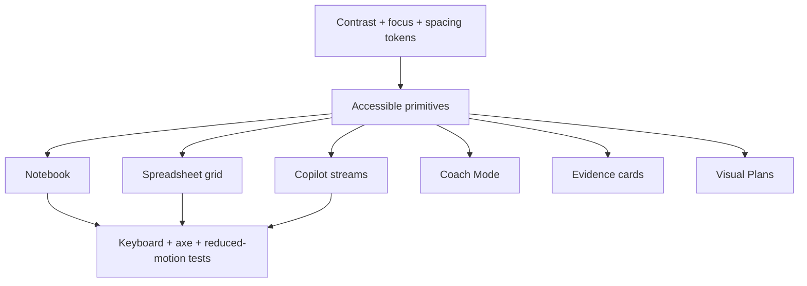

# Visual Plan: Accessibility WCAG 2.2

## Decision

NodeRoom should target WCAG 2.2 AA across the real work surfaces: notebook,
spreadsheet, Copilot, Coach Mode, evidence viewer, Visual Plans, and mobile room
controls.

## Battlefield Story

```text
keyboard-only analyst joins a diligence room
  -> captures a note
  -> navigates sheet cells
  -> reviews an agent plan
  -> opens evidence
  -> approves or rejects without mouse-only gestures
```

## Architecture



## Implementation Slice

| Need | File |
|---|---|
| Status announcements without token spam | `src/accessibility/liveRegion.tsx` |
| Spreadsheet-style arrow navigation | `src/accessibility/keyboardGrid.ts` |
| Modal/review focus containment | `src/accessibility/focusManagement.ts` |
| Respect `prefers-reduced-motion` | `src/accessibility/reducedMotion.ts` |

## Product Rules

- Agent streams announce status-level changes, not every token.
- Spreadsheet cells expose stable row/column navigation.
- Coach scores include text labels, not color alone.
- Evidence cards have keyboard-open actions and descriptive titles.
- Motion-heavy notebook/status UI must respect reduced motion.
- Visual Plans need text fallbacks for diagrams.

## Verification Plan

- Unit-test live region, keyboard grid, focus containment, and reduced-motion helpers.
- Add Playwright keyboard-only battlefield flow.
- Add axe checks for notebook, spreadsheet, Copilot, Coach, evidence, and Visual Plans.
- Manual-pass NVDA/VoiceOver, 200 percent zoom, high contrast, and mobile screen reader.

## Open Caveat

Helper primitives are not a WCAG claim. The claim requires full surface coverage,
automated checks, and manual assistive-technology review.
