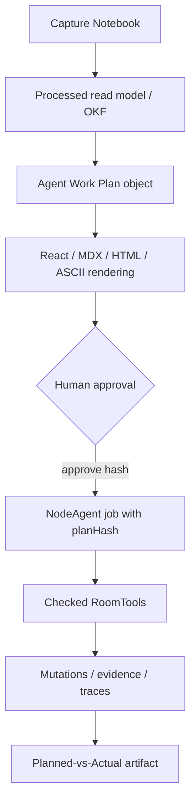
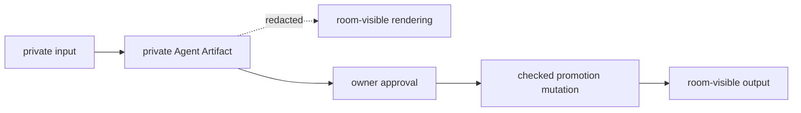

# Visual Plan: Agent Artifacts Structured Review

## Decision

Agent Artifacts are structured data first and visual renderings second. React,
MDX, HTML, and ASCII views are review surfaces; the approved object hash is the
execution contract.

## Target Flow



## Artifact Kinds

| Kind | Purpose |
|---|---|
| `agent_work_plan` | Shows intended reads, writes, evidence needs, privacy boundary, cost, and risks before execution. |
| `spreadsheet_diff_preview` | Shows before/after cell changes with source refs and status. |
| `evidence_card` | Preserves a source-backed claim without forcing it through chat. |
| `notebook_insert_proposal` | Stages notebook text for explicit user insertion. |
| `coach_feedback` | Stores evidence-grounded review-readiness feedback. |
| `planned_vs_actual` | Compares approved plan to real reads/writes/cost/evidence after execution. |
| `source_coverage_map` | Shows which claims have sources and which remain gaps. |

## Schema Sketch

```text
agentArtifacts
  roomId
  createdByJobId
  visibility
  ownerId
  kind
  status
  title
  summary
  structuredPayload
  renderHints
  evidenceRefs
  targetRefs
  planHash
  approvedBy
  approvedAt
  createdAt
  updatedAt
```

## Permission Boundary



## First Slice

Shipped backend slice:

1. Create structured `agent_work_plan` rows.
2. Compute canonical `payloadHash` / `planHash`.
3. Approve only by exact `planHash`.
4. Create/reuse a queued NodeAgent job with `request.approvedPlanHash`.

Remaining product slice:

1. Render the plan in the passive inbox / work surface.
2. Add Edit Scope / Dismiss actions.
3. Emit `planned_vs_actual` after completion.

## File Map

| Area | Files |
|---|---|
| Formal doc | `docs/AGENT_ARTIFACTS.md` |
| Schema | `convex/schema.ts` |
| Backend | `convex/agentArtifacts.ts`, `convex/agentJobs.ts` |
| Regression | `tests/notebookProcessingTarget.test.ts` |
| Store target | `src/app/store.tsx` |
| UI target | `src/ui/artifacts/*`, `src/ui/insights/NoteworthyInbox.tsx` |
| Runtime target | `src/nodeagent/core/types.ts`, `convex/agentJobRunner.ts` |

## Verification

- `tests/notebookProcessingTarget.test.ts` proves approval stores/checks the
  canonical `planHash` and starts a queued job carrying that hash;

Future verification:

- rendered artifact redacts private refs for non-owners;
- changed payloads cannot execute under an old approved hash;
- planned-vs-actual compares reads/writes/evidence/cost;
- MDX/HTML export is rendering-only and cannot mutate state.
