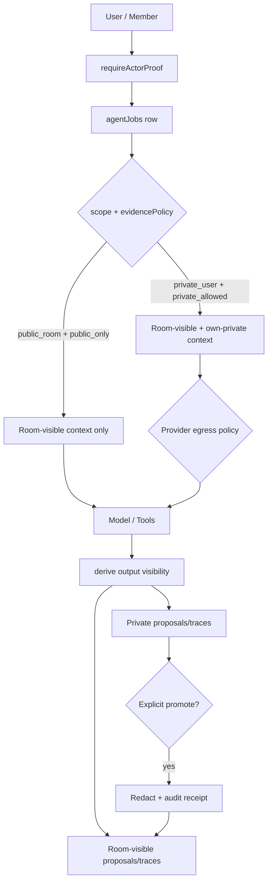
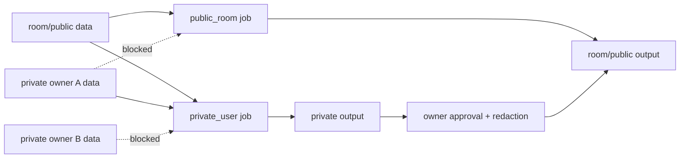

# Visual Plan: Agent Privacy and Security Architecture

## Decision

NodeRoom uses one shared NodeAgent runtime with many durable jobs. Privacy is enforced by scope, ownerId, visibility, channels, evidence policy, query filters, mutation checks, context builders, model egress policy, and redacted display surfaces.

## Architecture Diagram

## File Map

| Area | Files |
|---|---|
| Actor proof / channel auth | `convex/lib.ts`, `convex/messages.ts` |
| Artifact visibility | `convex/artifacts.ts`, `convex/rooms.ts` |
| Agent jobs / policies | `convex/agentJobs.ts`, `convex/agentJobRunner.ts`, `convex/agentWorkflows.ts` |
| Passive private feed | `convex/roomActivity.ts`, `convex/schema.ts` |
| Private streaming | `convex/streaming.ts`, `convex/http.ts` |
| OKF / retrieval | `convex/okf.ts`, `convex/embeddings.ts` |
| Tests to expand | `tests/privateArtifactVisibility.test.ts`, `tests/convexBoundaryPolicy.test.ts` |

## Data Boundary Map

## Policy Contract

- Public jobs cannot read private rows.
- Private jobs can read room-visible plus own-private rows only.
- Private-derived output remains private by default.
- Cross-boundary promotion requires explicit approval and audit receipt.
- Traces inherit the max sensitivity of inputs.
- Model egress follows data classification.
- Retrieval must filter by `roomId`, `visibility`, and `ownerId`.

## Implementation Plan

1. Add/centralize `convex/authz.ts` helpers.
2. Add visibility/ownerId to remaining content-bearing trace/retrieval rows.
3. Make model context building policy-driven.
4. Add output classification inheritance.
5. Add public/private trace redaction.
6. Add privacy regression tests per shared surface.

## Verification Plan

- Owner can read private row.
- Other member cannot read private row.
- Public agent cannot read private row.
- Other user's private agent cannot read private row.
- Public feed counts do not reveal private row volume.
- Public job + private data is blocked before model egress.
- Private-derived output remains private until promoted.

## Open Questions

- Should enterprise introduce `orgId`/`workspaceId` above `roomId`?
- Which providers are approved for private enterprise data?
- Should private traces be visible to org admins, room hosts, or owner only?
