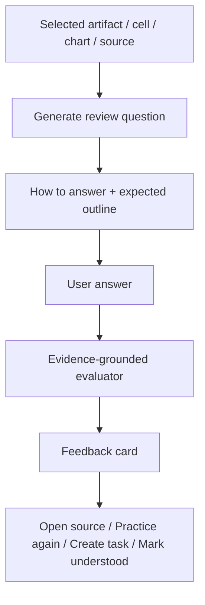

# Visual Plan: Coach Mode / Review Readiness

## Decision

Coach Mode turns artifacts into review drills. The system asks the user to explain the work, evaluates the answer against evidence and rubric, and links every gap to source, cell, trace, or OKF concept.

## UX Flow



## Layout Wireframe

```text
+--------------------------------------------------------------+
| NodeRoom · Review Readiness                                  |
+-----------------------------+--------------------------------+
| Work Surface                | Coach Panel                    |
| - selected sheet/cell       | Question                       |
| - source/evidence card      | How to Answer                  |
| - trace highlights          | Your Answer                    |
|                             | Feedback + score + gaps       |
+-----------------------------+--------------------------------+
```

## File Map

| Area | Files |
|---|---|
| Planned UI | `src/ui/coach/*` |
| Evidence UI | `src/ui/artifacts/EvidenceCarouselArtifact.tsx`, `src/ui/panels/TraceSurface.tsx` |
| Backend | `convex/coach.ts`, `convex/coachEvaluator.ts` |
| Existing evidence | `convex/evidence.ts`, `convex/captures.ts`, `convex/okf.ts` |
| Formal doc | `docs/COACH_MODE_REVIEW_READINESS.md` |

## Schema Map

```text
coachSessions -> coachQuestions -> coachAnswers -> coachFeedback
                                     -> masteryTags
                                     -> missedEvidenceRefs
                                     -> followUpTasks
```

## Rubric

- factual accuracy
- source grounding
- uncertainty handling
- calculation understanding
- cross-artifact consistency
- business judgment
- senior/client talk track
- next action

## Evaluator Contract

No feedback claim unless it can point to:

- OKF concept
- evidence fact
- source capture
- cell payload
- formula/chart dependency
- trace event
- review blocker

## P0 Demo

CardioNova runway / source gap / needs_review.

Question:

```text
Your VP asks why runway is marked needs_review. Explain.
```

Expected answer:

- runway depends on cash and monthly burn
- current source is manual/partial
- chart is estimate until verified
- next action is to ask management for current cash and burn

## Verification Plan

- Generate one question from selected artifact.
- Store user answer.
- Run deterministic checks first.
- Run one model evaluator only after submit.
- Feedback links to evidence/source/cell.
- Create follow-up task from missed item.

## Open Questions

- Should this be called Coach Mode or Review Readiness in default UI?
- Should feedback be private to the analyst or visible to the room/host?
- Which model tier is acceptable for client-ready evaluation?
