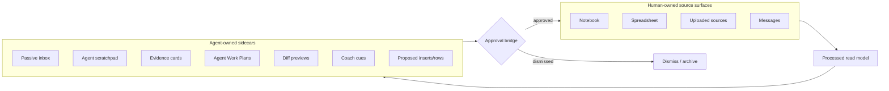
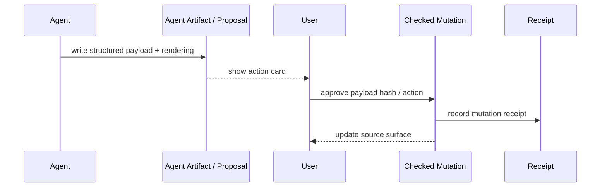

# Visual Plan: Human-Agent Approval Boundary

## Decision

Human-owned source surfaces and agent-owned sidecars must stay separate. Agents propose; humans approve source-of-truth mutations.

## Boundary Diagram



## File Map

| Area | Files |
|---|---|
| Inbox UI | `src/ui/insights/NoteworthyInbox.tsx`, `PassiveAgentChip.tsx` |
| Store actions | `src/app/store.tsx` |
| Passive backend | `convex/roomActivity.ts` |
| Draft/proposal path | `convex/drafts.ts`, `convex/artifacts.ts`, `convex/agentJobs.ts` |
| Agent Artifacts | `docs/AGENT_ARTIFACTS.md`, target `convex/agentArtifacts.ts` |
| Trace/receipts | `convex/agentSteps.ts`, `convex/agentJobs.ts`, `convex/schema.ts` |
| Formal doc | `docs/HUMAN_AGENT_APPROVAL_BOUNDARY.md` |

## Approval Actions

- Research
- Add to sheet
- Insert into notebook
- Create task
- Append as Agent Summary
- Dismiss

## Mutation Rule



## Privacy Rule

Private-derived proposal remains private until the owner approves promotion.

```text
private input -> private proposal -> redaction/approval -> room/public output
```

## Implementation Plan

1. Make every agent output land in a classified sidecar first.
2. Add explicit `proposed_insert` / `proposed_sheet_row` types.
3. Shipped backend: `agent_work_plan` approval by canonical `planHash` exists.
4. Add planned-vs-actual artifact type.
5. Add UI actions for approval bridge.
6. Record receipts for promoted changes.
7. Redact private proposal metadata for non-owners.

## Verification Plan

- Public user sees room proposals only.
- Private proposal is owner-only.
- Approval creates a receipt.
- Agent Work Plan approval checks canonical `planHash`.
- Dismiss does not mutate source surface.
- Insert into notebook/sheet is explicit and reversible where possible.

## Open Questions

- Which operations can be auto-commit safe?
- Should host review be required for public room outputs?
- How should undo work for approved agent insertions?
