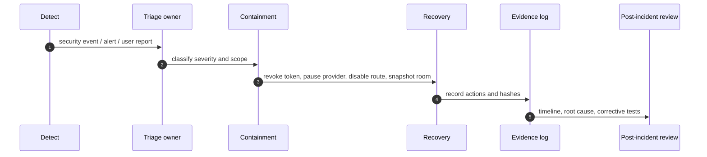

# Visual Plan: Incident Response and Disaster Recovery

## Decision

NodeRoom needs a written incident and recovery path before claiming enterprise
readiness. The code can emit audit/security events now; operations still need
runbooks, owners, drills, alerts, and restore proof.

## Incident Flow

## File Map

| Area | Files |
|---|---|
| Security event recording | `convex/securityEvents.ts` |
| Audit receipts | `convex/auditLog.ts`, `convex/agentSteps.ts` |
| Retention boundary | `convex/retention.ts` |
| Export/delete request path | `convex/exportDelete.ts` |
| Readiness doc | `docs/SECURITY_PRODUCTION_READINESS.md` |

## Runbook Skeleton

1. Assign incident commander.
2. Freeze or snapshot affected room/workspace.
3. Revoke affected member/session/provider credentials.
4. Disable risky model/provider route if relevant.
5. Export audit/security trace manifest.
6. Preserve evidence and source captures.
7. Restore from provider/platform backup if data loss occurred.
8. Add regression test for the failure mode.
9. Publish post-incident summary appropriate to the audience.

## RTO / RPO Target Draft

| Mode | Draft target |
|---|---|
| Live beta | Best-effort restore from platform/provider backup; no enterprise SLA claim. |
| Paid team | Documented RTO/RPO after backup/export drills exist. |
| Enterprise | Contracted RTO/RPO, access reviews, restore drills, monitoring, and vendor agreements. |

## Verification Plan

- Simulate provider failure and confirm graceful fallback.
- Simulate job interruption and confirm idempotent resume or honest failure.
- Simulate deletion request and confirm auditable operator-runbook state.
- Run restore drill from exported OKF/source manifest once export is complete.

## Open Caveat

This plan is a readiness target. It is not disaster-recovery proof until backup,
restore, alerting, and incident drills are run and recorded.
