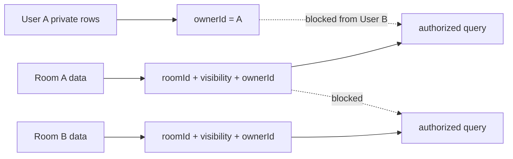

# Visual Plan: Multi-Tenancy and Data Isolation

## Decision

Every room/workspace-scoped row must be isolated by server-side policy. The
browser and model never get to rely on client-side filtering for privacy.

## Data Boundary

## Core Invariants

- Room-scoped rows carry `roomId`.
- Private rows carry `visibility: "private"` and `ownerId`.
- Public agent jobs read room/public data only.
- Private user jobs read room/public plus own private data.
- Shared feeds must not reveal private row volume to other users.
- Cross-room caches are allowed only for public-source evidence.

## Implementation Surfaces

| Surface | Files |
|---|---|
| Actor proof | `convex/lib.ts` |
| Artifact visibility | `convex/artifacts.ts`, `convex/rooms.ts` |
| Agent privacy model | `docs/AGENT_PRIVACY_SECURITY_ARCHITECTURE.md` |
| Agent Artifacts | `convex/agentArtifacts.ts`, `docs/AGENT_ARTIFACTS.md` |
| ProseMirror wrapper ACL | `convex/prosemirror.ts`, `convex/notebookProcessing.ts` |
| Export manifest | `convex/exportDelete.ts` |

## Verification Plan

- Owner can read private rows.
- Other member cannot read private rows.
- Public agent cannot read private rows.
- Private agent cannot read another user's private rows.
- Export manifest is room-scoped.
- Audit/security event lists require room membership.

## Open Caveat

Enterprise multi-tenancy may require an `orgId` or `workspaceId` layer above
`roomId`, plus admin roles, data residency policy, and access-review evidence.
