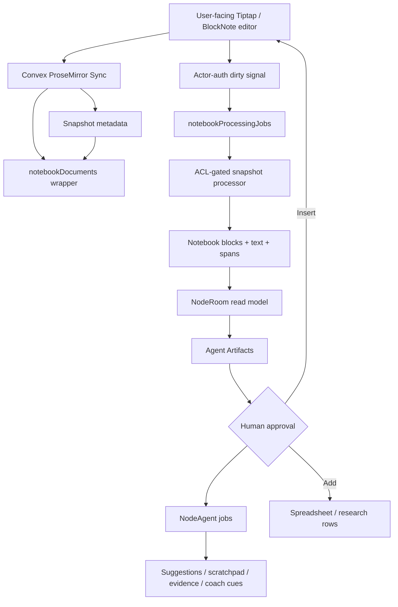
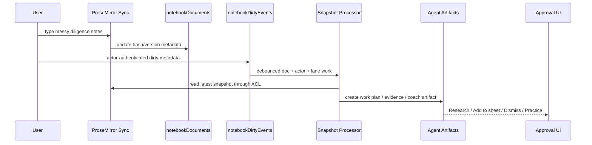

# Visual Plan: Native Notebook ProseMirror Sidecar

## Decision

Use Convex ProseMirror Sync for the human-owned collaborative notebook. Keep NodeRoom's intelligence, permissions, evidence, and agent outputs in sidecar/read-model tables outside the live editor.

## Target Architecture



## File Map

| Area | Files |
|---|---|
| Convex component mount | `convex/convex.config.ts` |
| ProseMirror wrapper | `convex/prosemirror.ts`, `convex/schema.ts` |
| Dirty-event processor | `convex/notebookProcessing.ts` |
| Agent Artifact approval | `convex/agentArtifacts.ts` |
| Current note editor | `src/ui/panels/Artifact.tsx` |
| Room/artifact shell | `src/ui/RoomShell.tsx`, `src/app/store.tsx` |
| Passive pipeline | `convex/roomActivity.ts`, `tests/roomActivityEvidenceAdapters.test.ts` |
| Notebook graph/read model | `convex/notebookGraph.ts`, `convex/okf.ts` |
| Target regression | `tests/notebookProcessingTarget.test.ts` |
| Target docs | `docs/NATIVE_NOTEBOOK_PROSEMIRROR_SIDECAR.md` |

## Data Contract

`notebookDocuments` maps component docs to NodeRoom business semantics:

```text
roomId
artifactId
elementId
prosemirrorDocId
visibility
ownerId
latestSnapshotHash
latestIndexedVersion
latestProcessedAt
```

Target processing metadata:

```text
notebookDirtyEvents:
  docId + actorId + processingLane + observedSnapshotVersion/hash

notebookProcessingJobs:
  dirtyEventId + processorVersion + schemaVersion + status

notebookBlocks / notebookClaims / notebookMentions:
  source snapshot version/hash + extracted blocks, claims, and mentions
```

Source spans, evidence refs, and OKF links are future adapter fields. The
shipped backend writes the three read-model tables above and feeds passive
classification from their extracted text.

## User Flow



## Agent Boundary

Agents read the processed notebook read model. Agents write sidecars and Agent
Artifacts by default:

- passive inbox items
- agent scratchpad
- entity work items
- evidence cards
- coach cues
- proposed notebook insertions

Agents should not freely co-edit the live document.

## Implementation Status

Shipped backend slice:

1. Keep current note editor as fallback.
2. Feature-flag ProseMirror Sync.
3. Add wrapper registry and access checks.
4. Keep snapshots registry-only as the bridge fix.
5. Add actor-authenticated dirty metadata mutation.
6. Add `notebookProcessingJobs`.
7. Build ACL-gated snapshot-to-read-model processor.
8. Feed passive intelligence from the processed read model.
9. Create the first Agent Artifact kind: `agent_work_plan` approval by `planHash`.

Remaining product/UI work:

1. Wire synced notebook idle/save to `markNotebookDirty`.
2. Render Agent Work Plans in the passive inbox / work surface.
3. Add user-approved insertion and Add-to-sheet paths.
4. Verify with two tabs, browser UI, and deployed private/public notebook cases.

## Verification Plan

- Two tabs sync the same notebook.
- Private notebook is invisible to other members.
- Public job cannot read private notebook snapshot.
- Passive chip appears once from the processed read model.
- ProseMirror snapshots do not create `roomActivityOutbox` rows.
- `elements["doc"]` is not hot-written on every native notebook edit.
- Non-owner editor attribution is preserved in dirty metadata.
- `tests/notebookProcessingTarget.test.ts` covers backend dedupe,
  ACL/revocation, read-model rows, private feed isolation, and planHash approval.
- Add-to-sheet and insert actions require user approval.
- Build/typecheck and Playwright happy path pass.

## Open Questions

- Tiptap or BlockNote as first UI wrapper?
- Store snapshot adapter output as blocks, OKF concepts, or both?
- How much direct server-side ProseMirror insertion is needed for approved inserts?
