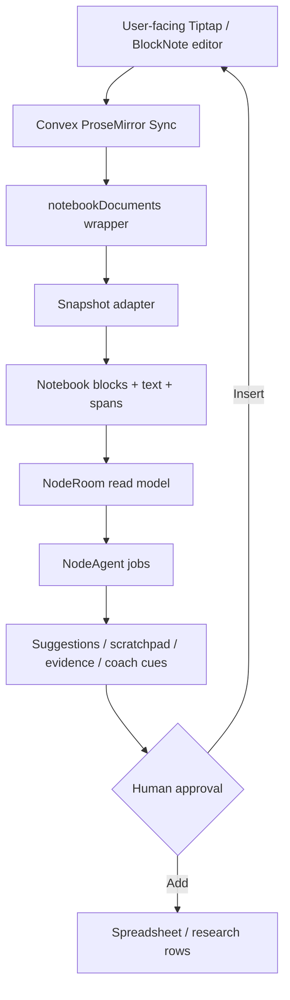
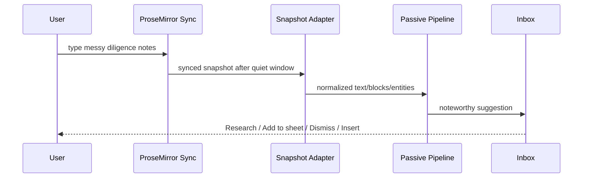

# Visual Plan: Native Notebook ProseMirror Sidecar

## Decision

Use Convex ProseMirror Sync for the human-owned collaborative notebook. Keep NodeRoom's intelligence, permissions, evidence, and agent outputs in sidecar/read-model tables outside the live editor.

## Target Architecture



## File Map

| Area | Files |
|---|---|
| Convex component mount | `convex/convex.config.ts` |
| ProseMirror wrapper | `convex/prosemirror.ts`, `convex/schema.ts` |
| Current note editor | `src/ui/panels/Artifact.tsx` |
| Room/artifact shell | `src/ui/RoomShell.tsx`, `src/app/store.tsx` |
| Passive pipeline | `convex/roomActivity.ts`, `tests/roomActivityEvidenceAdapters.test.ts` |
| Notebook graph/read model | `convex/notebookGraph.ts`, `convex/okf.ts` |
| Target docs | `docs/NATIVE_NOTEBOOK_PROSEMIRROR_SIDECAR.md` |

## Data Contract

`notebookDocuments` maps component docs to NodeRoom business semantics:

```text
roomId
artifactId
elementId
prosemirrorDocId
visibility
ownerId
latestSnapshotHash
latestIndexedVersion
latestProcessedAt
```

## User Flow



## Agent Boundary

Agents read processed snapshots. Agents write sidecars by default:

- passive inbox items
- agent scratchpad
- entity work items
- evidence cards
- coach cues
- proposed notebook insertions

Agents should not freely co-edit the live document.

## Implementation Plan

1. Keep current note editor as fallback.
2. Feature-flag ProseMirror Sync.
3. Add wrapper registry and access checks.
4. Build snapshot-to-block adapter.
5. Feed passive intelligence from processed snapshots.
6. Add user-approved insertion path.
7. Verify with two tabs and private/public notebook cases.

## Verification Plan

- Two tabs sync the same notebook.
- Private notebook is invisible to other members.
- Public job cannot read private notebook snapshot.
- Passive chip appears after pause.
- Add-to-sheet and insert actions require user approval.
- Build/typecheck and Playwright happy path pass.

## Open Questions

- Tiptap or BlockNote as first UI wrapper?
- Store snapshot adapter output as blocks, OKF concepts, or both?
- How much direct server-side ProseMirror insertion is needed for approved inserts?
