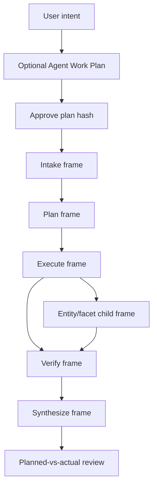

# Visual Plan: NodeAgent Harness Frame Runner

## Decision

The harness inside NodeAgent carries long-running reasoning as durable frames,
not hidden transcript memory. Frames make a complex request inspectable,
checkpointable, resumable, and reviewable.

## Frame Flow



## Frame Contract

| Piece | Role |
|---|---|
| `ContextPack` | The bounded room/evidence/cache envelope for one frame. |
| `runAgent` | The base model/tool loop. |
| `frameRunner` | Wrapper that runs one frame and returns a structured result. |
| `frameReducer` | Converts result to durable `FrameDelta`. |
| `frameVerifier` | Produces status/evidence receipts. |
| Agent Work Plan | Optional approved artifact that bounds intended reads, writes, evidence, and risk before frames run. |

## File Map

| Area | Files |
|---|---|
| Formal doc | `docs/HARNESS_RECURSIVE_REASONING.md` |
| Frame runner | `src/nodeagent/core/frameRunner.ts` |
| Context pack | `src/nodeagent/core/contextPack.ts` |
| Reducer/verifier | `src/nodeagent/core/frameReducer.ts`, `src/nodeagent/core/frameVerifier.ts` |
| Adoption proof | `examples/nodeagent-frame-runner/minimal.ts` |
| Omnigent boundary | `docs/OMNIGENT_INTEGRATION.md`, `examples/omnigent/nodeagent-room.yaml` |

## Required Smoke

Before changing this layer, run:

```bash
npm run nodeagent:frame:smoke
npm run omnigent:nodeagent:smoke
npm test -- --run tests/frameRunner.test.ts
```

## Battlefield Standard

When a task spans many companies, sources, rows, or model attempts, the user
should see durable progress instead of trusting an invisible chat transcript.
The happy path is visible from plan approval through frame execution to the
planned-vs-actual report.
