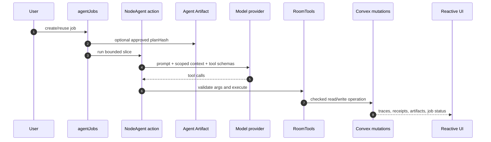

# Visual Plan: NodeAgent Runtime

## Decision

NodeAgent is the canonical agent harness for NodeRoom. Providers return text and
tool calls; NodeAgent owns context, tool validation, conflict recovery, budget,
traces, receipts, and managed writes.

## Runtime Flow

## Runtime Seams

| Seam | Purpose |
|---|---|
| Model adapter | Swap provider/model routes without changing tools. |
| `AgentTool[]` | Zod-typed operations the model may request. |
| `RoomTools` | Backend port for reads, writes, locks, drafts, messages, and evidence. |
| Convex functions | Durable policy boundary for queries, mutations, actions, and workflows. |
| Agent Artifact | Optional structured work plan/diff/evidence object approved by hash before execution. |

## File Map

| Area | Files |
|---|---|
| Runtime doc | `docs/AGENT_RUNTIME.md`, `docs/NODEAGENT_ARCHITECTURE.md` |
| Core loop | `src/nodeagent/core/runtime.ts` |
| Types | `src/nodeagent/core/types.ts` |
| Context | `src/nodeagent/core/context.ts`, `src/nodeagent/core/contextPack.ts` |
| Convex entry | `convex/agent.ts`, `convex/agentJobRunner.ts` |
| Store/UI | `src/app/store.tsx`, `src/ui/Chat.tsx` |
| Agent Artifacts | `docs/AGENT_ARTIFACTS.md`, `convex/agentArtifacts.ts` |

## Battlefield Standard

The model is allowed to be uncertain. The harness is not. It must preserve
versions, permissions, traces, and receipts no matter which provider is chosen.
