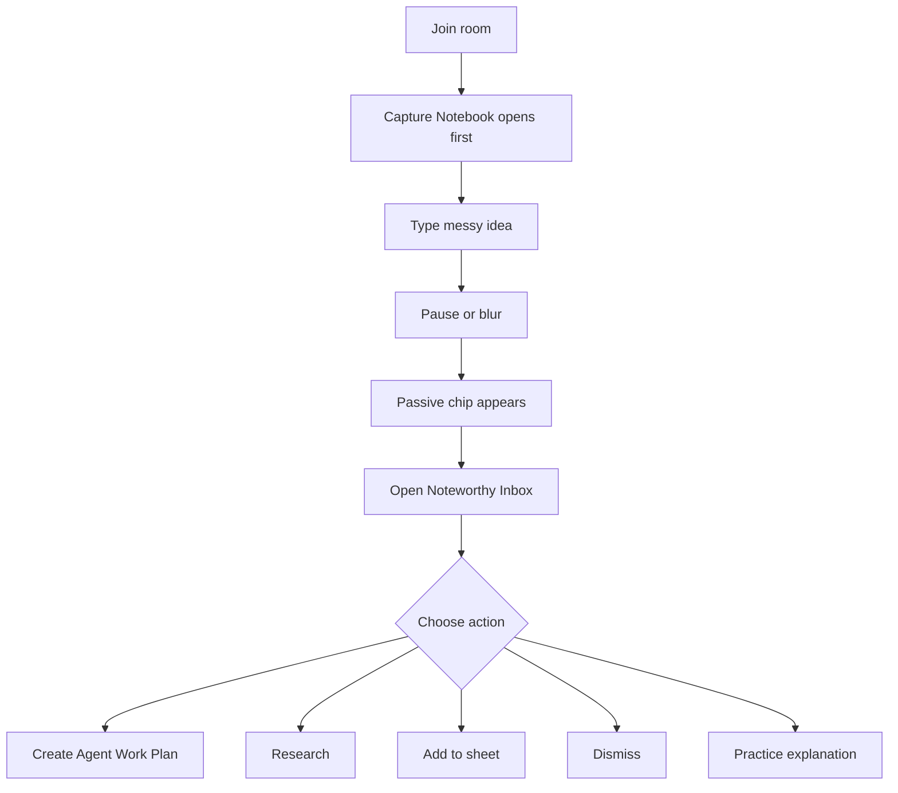

# Visual Plan: Notebook UI Inspiration And Motion

## Decision

Notebook motion should explain state, not own architecture. The editor substrate
stays Tiptap/ProseMirror plus Convex Sync; React Bits-style motion is used only
for passive reveal, inbox transitions, confirmations, and low-friction writing.

## User Flow

## Inspiration Map

| Reference | What NodeRoom borrows | What NodeRoom avoids |
|---|---|---|
| Notion | Calm writing surface, low-chrome blocks. | Treating AI output as indistinguishable from human source text. |
| Granola | Capture now, structure after pause. | Hidden meeting-note magic with no approval bridge. |
| Linear | Triage state, accept/dismiss/route actions. | Decorative motion that slows operators down. |
| Coda / Airtable | Notes becoming structured records. | Spreadsheet mutation without evidence and version checks. |
| Perplexity / Elicit | Source-backed findings. | Answer cards without provenance. |

## Motion Rules

- Animate passive chip reveal and inbox card entry.
- Show clear state changes for Researching, Added, Dismissed, and Practice.
- Do not animate editable text, spreadsheet cells, evidence quotes, or live
  cursors in a way that hides state.
- Motion should be short, reversible, and tied to a product state.
- Substantial agent outputs become Agent Artifacts, not hidden notebook edits.

## File Map

| Area | Files |
|---|---|
| Notebook UI | `src/ui/panels/Artifact.tsx` |
| Passive chip/inbox | `src/ui/insights/PassiveAgentChip.tsx`, `src/ui/insights/NoteworthyInbox.tsx` |
| Styles/motion | `src/app/styles.css` |
| Agent Artifact backend/product target | `docs/AGENT_ARTIFACTS.md` |
| Formal doc | `docs/NOTEBOOK_UI_INSPIRATION_MOTION.md` |
| Walkthrough spec | `scripts/walkthroughs/specs.ts` |

## Battlefield Standard

In a real diligence room, motion earns its keep only if it tells the analyst:
"the room noticed this once, it is waiting for your choice, and it has not
changed your source-of-truth work without you."
