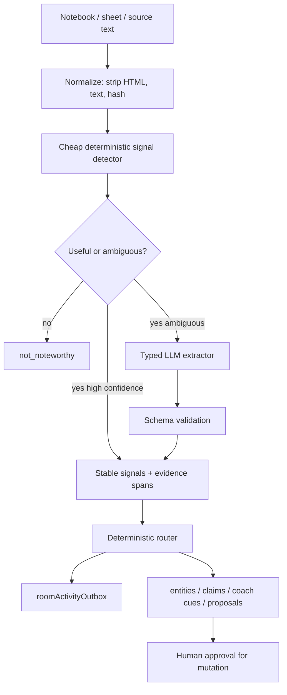

# Visual Plan: Passive Classifier Production Pattern

## Decision

Use deterministic orchestration plus typed model-assisted extraction. Do not let an LLM agent manage the passive intelligence pipeline end to end.

## Pipeline Diagram



## File Map

| Area | Files |
|---|---|
| Classifier | `convex/noteworthy.ts`, `convex/roomActivity.ts` |
| Passive queue | `convex/schema.ts`, `convex/roomActivity.ts` |
| Agent job creation | `convex/agentJobs.ts` |
| Tests | `tests/passiveIntelligence.test.tsx`, `tests/roomActivityEvidenceAdapters.test.ts` |
| Formal doc | `docs/PASSIVE_CLASSIFIER_PRODUCTION_PATTERN.md` |

## Stable Result Shape

```text
status: noteworthy | not_noteworthy | needs_model_review
signals: stable enum values
entities: typed extracted objects
evidenceSpans: exact source snippets
confidence: per signal/entity
classifierVersion: deterministic version
modelVersion/promptVersion: if model participated
```

## Signal Map

| Signal | Purpose |
|---|---|
| `finance_signal` | Funding, runway, burn, ARR, valuation |
| `open_question_or_task` | Ask/follow-up/todo language |
| `person_or_interaction` | Meeting/call/person context |
| `organization_candidate` | Possible company/product/fund |
| `company_verified` | Resolved company entity |
| `source_gap` | Claim needs source/evidence |
| `diligence_risk` | Risk, blocker, needs_review |

## Test Plan

Use three lanes:

1. Contract tests: status, HTML stripping, required signal, clean evidence.
2. Taxonomy tests: exact deterministic rules only.
3. Golden semantic evals: minimum expected signals with allowed extras.

## LLM Boundary

LLM can do:

- entity extraction
- claim extraction
- source-gap detection
- organization resolution
- coach cue generation
- proposed rows

LLM cannot do:

- permissions
- scheduling
- idempotency
- privacy routing
- retries
- source-of-truth writes

## Implementation Plan

1. Split `reasons` into `signals`, `entities`, `evidenceSpans`, and display copy.
2. Add stable ordering and classifier version.
3. Add `organization_candidate` before `company_verified`.
4. Add typed extractor for ambiguous cases.
5. Update tests to assert contracts, not incidental full arrays.

## Open Questions

- Which signals are routing-critical vs display-only?
- Which cases warrant LLM extraction vs deterministic-only?
- Should classifier outputs be cached by content hash and version?
