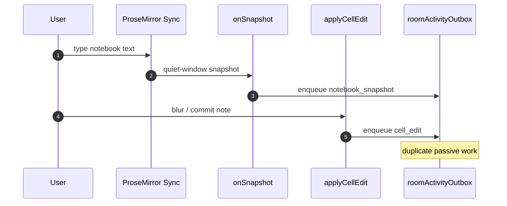
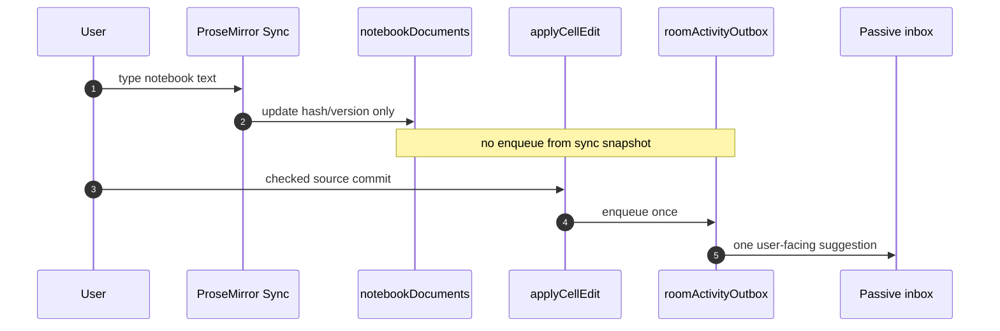
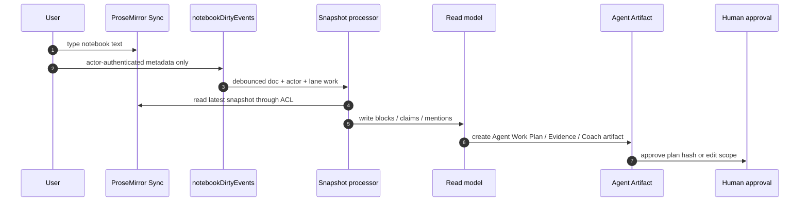

# Visual Plan: Passive Notebook Single-Source Fix

## Decision

ProseMirror Sync is a collaborative text transport. It may update
`notebookDocuments` registry metadata, but it must not enqueue passive
intelligence. The current bridge routes passive work through the checked
`applyCellEdit` path. The target routes it through actor-authenticated dirty
metadata, an ACL-gated processor, and a processed read model.

## Battlefield Story

```text
banker types messy diligence note
  -> teammates see live text
  -> user pauses
  -> one passive inbox item appears
  -> user chooses Research / Add / Dismiss / Practice
  -> agent writes sidecars until approval
```

The bug made the middle step noisy: both snapshot sync and artifact commit could
enqueue passive work. The fix restores one signal for one captured thought. The
next implementation step removes full HTML blur commits from the native
notebook hot path.

## Before



## Bridge After



## Target After



## Convex Contract

| Function kind | Role in this fix |
|---|---|
| `query` | `getNotebookDoc` reads the doc capability only after requester proof and artifact visibility pass. |
| `mutation` | `ensureNotebookDoc` creates the wrapper row; bridge `applyCellEdit` commits source text and enqueues once; target `markNotebookDirty` writes metadata only. |
| `action` | Agent/model/capture work runs outside the database and returns to mutations for durable writes. |
| component callback | `onSnapshot` writes registry metadata only. |

## File Map

| Area | Files |
|---|---|
| Fix implementation | `convex/prosemirror.ts`, `convex/artifacts.ts` |
| Target processing | `convex/notebookProcessing.ts`, `convex/agentArtifacts.ts` |
| Registry schema | `convex/schema.ts` |
| UI proof threading | `src/ui/App.tsx`, `src/ui/RoomShell.tsx`, `src/ui/panels/Artifact.tsx` |
| Tests | `tests/nativeNotebookProsemirror.test.ts`, `tests/nativeNotebookProsemirrorStatic.test.ts`, `tests/notebookProcessingTarget.test.ts` |
| Explainer | `docs/PASSIVE_NOTEBOOK_SINGLE_SOURCE_FIX.md` |
| Shiki visual | `docs/visuals/passive-notebook-single-source-code.html` |

## Code Visual

Open the generated Shiki artifact:
[`docs/visuals/passive-notebook-single-source-code.html`](../../docs/visuals/passive-notebook-single-source-code.html).

Regenerate it with:

```bash
npm run docs:code-visuals
```

## Tests

- Capability secret is not returned without requester proof.
- Capability secret is rejected after identity-backed room leave.
- `submitSnapshot` patches registry hash/version only.
- `convex/prosemirror.ts` has no executable `enqueueRoomActivity` call.
- Walkthrough review shows one passive suggestion in the first-time banker flow.
- `tests/notebookProcessingTarget.test.ts` covers the target backend slice: one
  dirty event per actor/lane, one read-model update, one passive item from the
  read model, active-membership recheck, private read model/feed isolation, and
  `agent_work_plan` approval by exact `planHash`.

## Open Caveat

The third-party ProseMirror sync guard receives `(ctx, id)`, not the requester
token. Identity-backed rooms can enforce revocation in the guard. Token-only
local/demo rooms still treat the random doc id as the capability.
