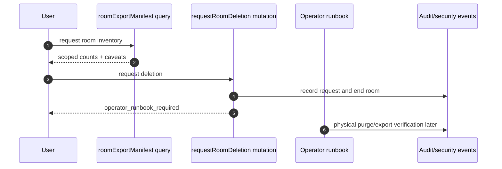

# Visual Plan: Privacy, Retention, and Deletion

## Decision

NodeRoom must separate three concepts that are often conflated:

```text
telemetry retention != room export != verified product-data deletion
```

Telemetry pruning is implemented for high-volume traces. Product-data export and
deletion need auditable manifests, operator runbooks, binary-storage handling,
and verification receipts before they become a compliance claim.

## Flow



## Implementation Surfaces

| Need | File |
|---|---|
| Telemetry prune policy | `convex/retention.ts` |
| Room export inventory | `convex/exportDelete.ts` |
| Deletion request receipt | `convex/exportDelete.ts` |
| PII redaction | `src/security/pii.ts`, `src/security/redaction.ts` |
| Audit hash | `src/security/auditHash.ts`, `convex/auditLog.ts` |

## Current Claim

- Telemetry prune exists for `traces`, `agentSteps`, and `agentOperationEvents`.
- Product data is deliberately not pruned by the telemetry cron.
- Room export manifest reports scoped counts.
- Deletion request ends the room and records an auditable request.
- Physical purge, storage deletion, restore-proof, and legal retention handling
  are not claimed by the mutation.

## Verification Plan

- Convex-test telemetry pruning leaves product data intact.
- Convex-test export manifest counts room-scoped rows.
- Convex-test deletion request requires host proof.
- Future: storage purge receipt, OKF export, source-capture archive, and restore drill.

## Open Caveat

GDPR/CCPA-style rights require policy and operational evidence in addition to
code. HIPAA deletion/retention depends on whether ePHI is processed and on BAA
requirements.
