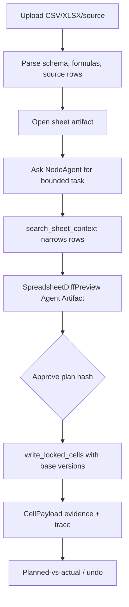

# Visual Plan: Professional Spreadsheet Workflows

## Decision

Spreadsheet work must be evidence-bearing, formula-safe, versioned, and
reviewable. NodeRoom should feel like an analyst workroom, not a chat wrapper
that dumps answers into cells.

## Core Flow

## Pain Points

| Battlefield pain | Product rule |
|---|---|
| Formula cells get hardcoded. | Preserve formulas unless explicitly targeted. |
| Agent overwrites a human edit. | Lock/CAS/draft/no-clobber path for every write. |
| Correct cells churn versions. | Skip no-op writes and preserve base versions. |
| Totals lack proof. | Cite source rows, captures, or evidence facts. |
| Sensitive rows leak to public chat. | Redact PII/private data from public outputs. |

## File Map

| Area | Files |
|---|---|
| Product doc | `docs/PROFESSIONAL_SPREADSHEET_WORKFLOWS.md` |
| Artifact mutation | `convex/artifacts.ts` |
| RoomTools adapter | `convex/convexRoomTools.ts` |
| Agent tools | `src/nodeagent/skills/spreadsheet/cellMutator.ts` |
| Formula/eval support | `src/nodeagent/skills/finance/*`, `src/nodeagent/core/*` |
| Agent Artifact backend | `docs/AGENT_ARTIFACTS.md`, `convex/agentArtifacts.ts` |
| Benchmarks | `scripts/spreadsheetbench-*`, `docs/eval/*spreadsheet*` |

## Verification

- Targeted CAS/no-clobber tests.
- Professional workflow evals.
- SpreadsheetBench staging/proof scripts.
- Live chat-intake managed-lock smoke.
- SpreadsheetDiffPreview approval checks canonical plan hash.
- Planned-vs-actual compares intended vs committed cells and evidence refs.
- Visual walkthroughs for edit, undo, review mode, and research upsert.

## Backend Portability

The important shape is not Convex-specific: use version columns or conditional
writes, isolate source files, store evidence refs, and make every write return a
receipt. Convex makes this reactive and compact, but the invariant is portable.
