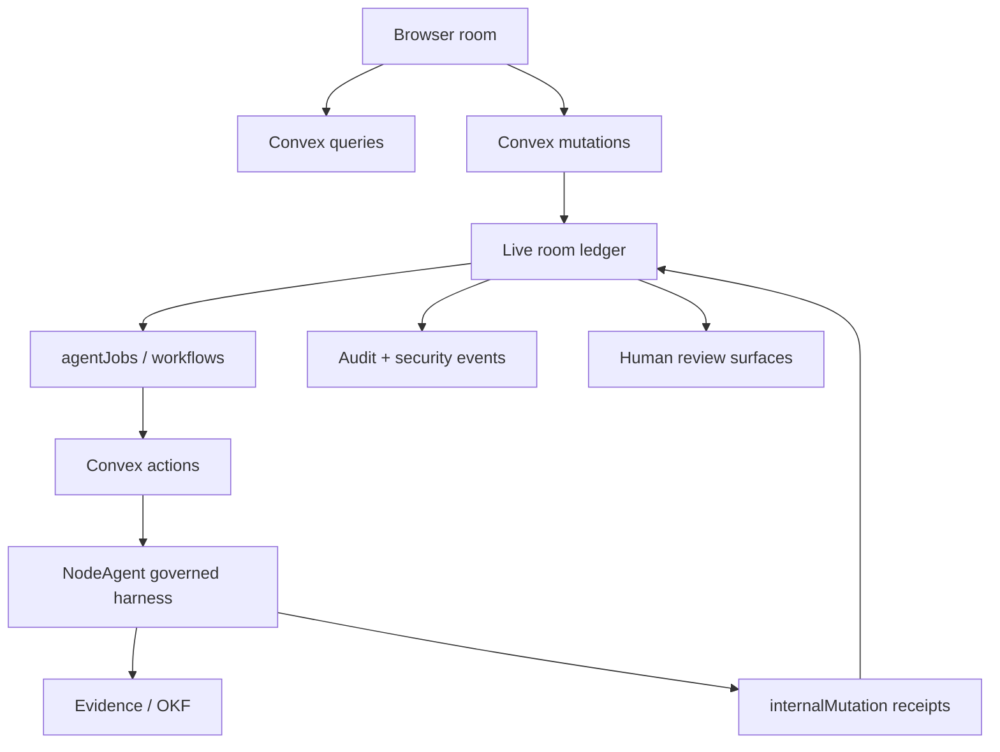

# Visual Plan: Security and Production Readiness

## Decision

NodeRoom should present production readiness as a gate-by-gate control story,
not as a blanket enterprise-compliance claim. The architecture is ready to
support high-trust work; compliance is earned only by evidence.

## Battlefield Story

```text
analyst works in a live room
  -> private notes stay private
  -> agent plans before acting
  -> evidence is captured and cited
  -> human approves exact payload hash
  -> audit/security events explain what happened later
```

## Architecture



## Control Map

| Risk | Control | Files |
|---|---|---|
| Untrusted content becomes instructions | Fence and score suspicious source text | `src/security/promptInjectionFence.ts` |
| PII leaks into public previews | Detect and redact obvious PII | `src/security/pii.ts`, `src/security/redaction.ts` |
| Receipts are not reproducible | Stable JSON and SHA-256 hashes | `src/security/auditHash.ts`, `convex/auditLog.ts` |
| Abuse/cost runaway | Fixed-window/token-bucket helpers and room spend snapshots | `src/security/rateLimit.ts`, `convex/usageLimits.ts` |
| Security events vanish | Room-scoped security event trace rows | `convex/securityEvents.ts` |
| Compliance overclaim | Explicit export/delete and retention boundaries | `convex/exportDelete.ts`, `convex/retention.ts` |

## Convex Contract

| Function kind | Rule |
|---|---|
| `query` | Read current state only after membership and visibility checks. |
| `mutation` | Apply user intent, approval, deletion request, and room-scoped writes. |
| `internalMutation` | Commit agent receipts, audit events, security events, and retention work. |
| `action` | Run slow external/provider work and return to mutations for durable writes. |

## Verification Plan

- Unit-test sanitization, PII redaction, prompt-injection fencing, audit hashes, and rate limits.
- Convex-test audit/security events, usage snapshots, export manifests, deletion requests, and retention policy.
- Browser-test the battlefield flow with two users and a private/public boundary.
- Keep `docs/PRODUCTION_READINESS.md` honest about live audit gaps.

## Open Caveat

This plan adds primitives and documentation. It does not complete enterprise
policy, incident, vendor, access-review, monitoring, backup, legal, or regulated
data obligations.
