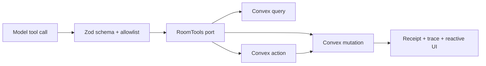

# Visual Plan: Shipped Tools And RoomTools

## Decision

Ship model tools as narrow product controls over `RoomTools`, not raw backend
access. The model asks; the runtime validates; the backend enforces.

## Tool Boundary

## Tool Classes

| Class | Examples | Product rule |
|---|---|---|
| Reads | `read_range`, `search_sheet_context`, `fetch_source` | Return scoped context with versions and evidence refs. |
| Writes | `write_locked_cells`, `edit_cell`, `update_wiki` | Mutate only through checked backend functions. |
| Coordination | `propose_lock`, `release_lock` | Reserve/release work areas with receipts. |
| Capture | `capture_source` | External work returns evidence through mutations. |
| Review | approve/dismiss/passive research/Coach Mode | Human action bridges sidecar to source surface. |
| Agent Artifacts | shipped: approve work plan; target: edit scope / planned-vs-actual | Structured payload hash drives execution; rendering is review-only. |

## File Map

| Area | Files |
|---|---|
| Formal doc | `docs/SHIPPED_TOOLS_AND_ROOMTOOLS.md` |
| Tool types | `src/nodeagent/core/types.ts` |
| Spreadsheet tools | `src/nodeagent/skills/spreadsheet/cellMutator.ts` |
| In-memory tools | `src/nodeagent/skills/integration/noderoomAdapter.ts` |
| Convex tools | `convex/convexRoomTools.ts` |
| Server registry/capture | `src/nodeagent/skills/search/*`, `convex/agent.ts` |
| Agent Artifact backend | `docs/AGENT_ARTIFACTS.md`, `convex/agentArtifacts.ts` |

## Battlefield Standard

The tool list should teach the model how to work safely, but the model should
not carry the safety burden alone. Composite tools move coordination back into
runtime code where it can be tested.

Executable visual plans and Agent Work Plans must run from structured payloads,
not arbitrary rendered HTML/MDX. Approval stores a canonical plan hash now;
planned-vs-actual reports should compare backend receipts against that hash when
that renderer/backend slice lands.
