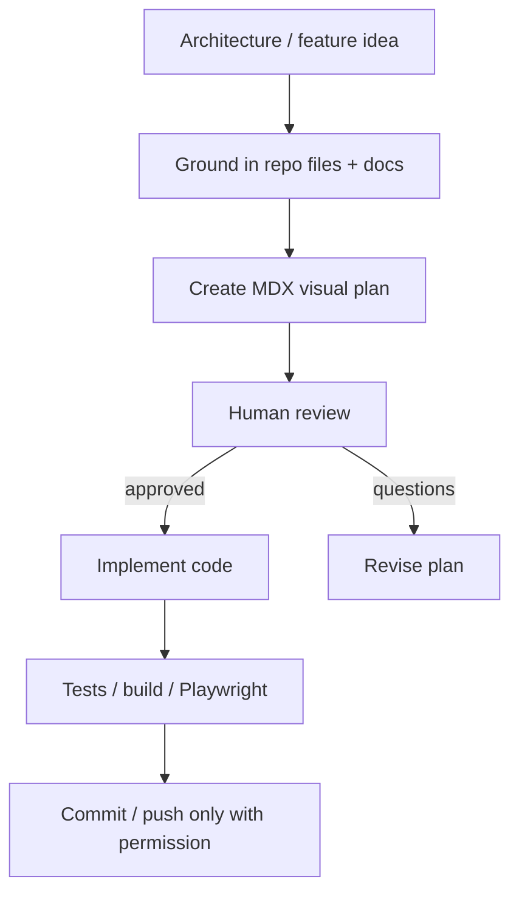

# Visual Plan: Visual Plan Review Surface

## Decision

Use Visual Plans for NodeRoom work that is too risky, visual, or architecture-heavy to review as terminal Markdown.

## Planning Flow



## Visual Plan Surfaces

| Need | Surface |
|---|---|
| Architecture | Mermaid / draw.io diagram |
| UI-heavy work | Wireframe / state map |
| Data-heavy work | Schema/table map |
| API-heavy work | Query/mutation contract |
| Runtime-heavy work | Sequence diagram |
| Security work | Boundary/redaction map |
| Reviewer alignment | Open questions and approval checklist |

## NodeRoom Use Cases

- Native notebook / ProseMirror migration
- Agent privacy and security architecture
- Passive classifier redesign
- Human-agent approval boundary
- Coach Mode / Review Readiness
- OKF/evidence pipeline changes
- Agent runtime / Workflow / Workpool changes

## Required Sections

```text
Decision summary
Current-state map
Target-state architecture diagram
Data-flow diagram
File map
Schema/table map
API/query/mutation contract
UI states or wireframes
Privacy/security boundary
Test and verification plan
Rollout / feature flag plan
Open questions requiring approval
```

## Storage Policy

Use source-controlled local plans for sensitive work:

```text
plans/<slug>/plan.mdx
```

Use hosted/shareable links only when the plan is safe to share and collaboration comments are useful.

## Review Checklist

- Is the plan grounded in actual repo files?
- Are schemas and APIs explicit?
- Are public/private boundaries explicit?
- Are UI states represented visually?
- Are tests and verification clear?
- Are open questions separated from decisions?
- Is implementation blocked until approval?

## Output of This Pass

This repository now has local Visual Plan MDX files for the major architecture threads discussed on 2026-06-18.

## Open Questions

- Should we install the BuilderIO/Agent-Native visual-plan skill?
- Should `plans/` be committed or treated as local planning artifacts?
- Should Visual Plans become mandatory for schema/security/runtime changes?
